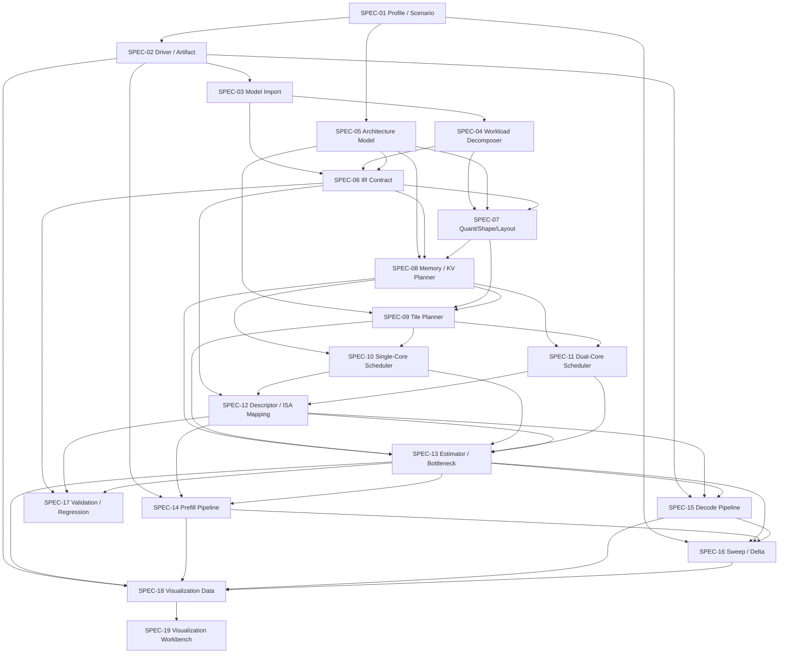

# RISC-V + NPU 评估编译器实施依赖、分期与状态

## 1. 状态说明

本路线图从 2026-03-07 开始采用显式状态标记：

- `done`
  - 当前仓库已经存在稳定契约、实现和验证，可作为下游阶段依赖。
- `in_progress`
  - 已有可运行骨架或部分实现，但还没有满足该 SPEC 的完整验收。
- `not_started`
  - 还没有稳定主线，或只有上游准备工作，没有形成可依赖交付物。

## 2. 当前阶段状态总览

| 阶段 | 包含 Spec | 状态 | 当前判断 |
| --- | --- | --- | --- |
| Phase A | SPEC-01, SPEC-02, SPEC-05, SPEC-06 | `done` | 契约、工件、架构模型、IR 栈都已经稳定落地。 |
| Phase B | SPEC-03, SPEC-04, SPEC-07 | `done` | import/decomposition/bound-NIG/report/smoke gate 已收口。 |
| Phase C | SPEC-08, SPEC-09, SPEC-10, SPEC-11, SPEC-12 | `done` | canonical `run-phase-c-gate` 已可稳定通过，且 `tests/smoke -m local_smoke` / `tests/smoke -m milestone_matrix` 均为绿；`SPEC-08` 到 `SPEC-12` 已按当前 accepted scope 收口。 |
| Phase D | SPEC-13, SPEC-14, SPEC-15, SPEC-16 | `in_progress` | `SPEC-13` 已有 descriptor-driven estimator/workflow/CLI/smoke foundation，`SPEC-14` 已有 prefill top-level foundation，`SPEC-15` 已有 decode top-level foundation，`SPEC-16` 已有 sweep/delta workflow、CLI 和 smoke foundation。 |
| Phase E | SPEC-17, SPEC-18, SPEC-19 | `in_progress` | `SPEC-17` 已有大量 regression tests，`SPEC-18` 已有 visualization bundle workflow、CLI 和 smoke foundation，且 `vmem_view.regions` 已带 per-region backing-store/memory-class attribution；`SPEC-19` 已有 static workbench、cross-run catalog workflow、CLI、smoke foundation，以及 sweep/workspace discovery、catalog grouping、panel deep-link、workbench cross-links、saved-view/export controls、SVG snapshot export、catalog compare tray、baseline-pinned compare workspace、baseline/candidate role swap、compare scope toggle、shared summary-metric compare、selected-panel deep-link navigation、catalog/workbench round-trip return navigation，以及 memory panel 的 per-region backing-store/memory-class visibility。 |

结论：

- Phase A 已完成。
- Phase B 已完成。
- 当前关键路径已转到 Phase D / `M3` 收口，并辅以 `SPEC-19` 的产品化 hardening。

## 3. Spec 状态矩阵

| Spec | 名称 | Phase | 状态 | 当前证据 | 收口门槛 |
| --- | --- | --- | --- | --- | --- |
| SPEC-01 | 目标配置与场景配置系统 | A | `done` | 已有 `target/scenario profile` schema、loader、fixtures、diagnostics。 | 保持兼容；后续只允许增量扩展。 |
| SPEC-02 | 驱动入口与工件契约 | A | `done` | 已有 `validate-profile`、`init-run`、`run-frontend-analysis`、manifest/run-summary/run-root artifact。 | 保持 artifact contract 稳定。 |
| SPEC-03 | 模型导入与规范化图 | B | `done` | 已支持 `ONNX -> GraphIR -> canonical GraphIR`、`source_ref/audit_ref`、Gemma3 shape binding。 | 继续 harden，但不阻塞 Phase C。 |
| SPEC-04 | 工作负载拆解与宏算子识别 | B | `done` | 真实 Gemma3 主路径已能 lower 到 NIG，unsupported lowering nodes = `0`。 | 继续补 report/diagnostics，但不阻塞 Phase C。 |
| SPEC-05 | 架构语义模型 | A | `done` | 已有 capability model、constraint checker、query API、单核/双核 baseline target。 | 保持 target contract 稳定。 |
| SPEC-06 | IR 栈与 Lowering 契约 | A | `done` | 五层 IR schema、validator、traceability、JSON roundtrip 已完成。 | 保持 version/invariant 稳定。 |
| SPEC-07 | 量化/形状/布局绑定 | B | `done` | 已有 bound-NIG contract、quant/layout/memory-class/attention binding、binding report、四象限 smoke matrix。 | 保持 contract 稳定；后续只允许增量扩展。 |
| SPEC-08 | VMEM/KV/地址规划器 | C | `done` | 已有 `MemoryPlanArtifact`、lifetime reuse、DDR/storage binding surface、fit-aware diagnostics、`SPEC-09` tile-planner 消费，以及 `SPEC-12` 对 `storage_binding_id/backing_store`、`SPEC-13` 对 `peak_bytes_by_backing_store/peak_bytes_by_memory_class`、`SPEC-14/15` 对 hottest-region backing-store/memory-class attribution、`SPEC-18` 对 per-region backing-store/memory-class attribution 的直接消费；现在也已有 `memory_planner_closure_report.json` 统一枚举这些 downstream consumers，且 `phase_c_acceptance_report.json` 已能汇总 canonical `single-core/dual-core x prefill/decode` matrix。 | 当前 accepted planner/downstream contract 已由 `run-phase-c-gate` 与 milestone smoke 覆盖；只有出现新的 concrete consumer regression 时才 reopening。 |
| SPEC-09 | Tile 候选规划器 | C | `done` | 已有 `TilingPlanArtifact`、storage-aware ranking、`run-tile-planning` workflow/CLI，以及被 `SPEC-10/11` 直接消费的稳定候选面。 | 当前 GEMM-like / attention candidate surface + untiled-helper scheduling 已由 canonical gate 与 milestone smoke 覆盖；更广 coverage 只在 concrete downstream failure 时 reopening。 |
| SPEC-10 | 单核映射与调度器 | C | `done` | 已有扩展后的 `ScheduleIR`、interval reservations、duration policy、phased reservations，以及 `RMSNORM/GEGLU/ELEM_ADD` helper-store 审计结果。 | acceptance list 已冻结，当前 scheduler surface 已由 canonical gate 与 milestone smoke 证明可稳定供 `SPEC-12/13` 消费。 |
| SPEC-11 | 双核映射与调度器 | C | `done` | 已有 dual-core `ScheduleIR` foundation、transfer/sync overlap、shared-resource contention，以及 `RMSNORM/GEGLU/ELEM_ADD` helper-store 审计结果。 | acceptance list 已冻结，当前 dual-core surface 已由 canonical gate 与 milestone smoke 证明可稳定供 `SPEC-12/13` 消费。 |
| SPEC-12 | 描述符生成与 ISA 覆盖映射 | C | `done` | 已有稳定 `DescriptorIR` / packed stream artifact、summary-grade packed consumer proof、workbench packed-summary visibility，以及 structured `address_fields` 对 `storage_binding_id/backing_store` 的直接复用。 | packed summary consumer proof + workbench summary visibility 已纳入当前 canonical gate；per-record drilldown 和更重 ABI hardening 不再阻塞 `M2`。 |
| SPEC-13 | 性能估算与瓶颈分析器 | D | `in_progress` | 已有 pseudo/fallback `AnalysisIR` estimator，以及 descriptor-driven `AnalysisIR` / `PerfSummaryReport`、run-root workflow、CLI 和四象限 smoke foundation；`PerfSummaryReport` 现已带 schedule occupancy、bandwidth/VMEM breakdown、per-region backing-store attribution、per-region memory-class attribution，以及稳定的 per-node / per-layer cycle-byte summaries、summary-grade `phase_attribution`，以及 overlap-aware `critical_path_cycles` top-line summary。 | 仍缺更深 cycle fitting，以及高于当前 critical-path / token-phase / node-layer summary surface 的 compare-grade 聚合。 |
| SPEC-14 | Prefill 评估流水线 | D | `in_progress` | 已有 `PrefillEvaluationReport` contract、prefill report builder、run-root workflow、CLI 和 `single-core/dual-core x prefill` smoke foundation；`memory_hotspot` 已直接带 hottest-region backing-store attribution 和 memory-class attribution，且现已新增 `node_hotspots` 与 `layer_breakdown`；当前 `SPEC-16` sweep compare 已正式消费 prefill top-level metrics 形成结构化 `prefill_compare`，并已有独立 `PhaseDCompareReport` artifact 将其抬升到 standalone compare surface。 | 仍缺更细的 layer-level prefill 视图，以及更强的 top-level eval compare 闭环。 |
| SPEC-15 | Decode 评估流水线 | D | `in_progress` | 已有 `DecodeEvaluationReport` contract、decode report builder、run-root workflow、CLI 和 `single-core/dual-core x decode` smoke foundation；`memory_hotspot` 已直接带 hottest-region backing-store attribution 和 memory-class attribution，且现已新增 `node_hotspots` 与 `layer_breakdown`；当前 `SPEC-16` sweep compare 已正式消费 decode top-level metrics 形成结构化 `decode_compare`，并已有独立 `PhaseDCompareReport` artifact 将其抬升到 standalone compare surface。 | 仍缺更细 token latency 拆解、`kv_len` sweep aggregation，以及更强的 top-level eval compare 闭环。 |
| SPEC-16 | 假设扫描与差异对比引擎 | D | `in_progress` | 已有 `SweepSpec` / `SweepDeltaReport` contract、serial rerun workflow、CLI 和 Gemma3 sweep smoke foundation；当前 comparison surface 已包含 metric、macro、layer deltas，以及 mode-aware 的 `prefill_compare` / `decode_compare` top-level summaries，并进一步保留 phase-cycle、phase-share 与 phase-byte rows；同时也已有 `run-phase-d-compare` workflow/CLI 和 standalone `PhaseDCompareReport` artifact。 | 仍缺更丰富的 layer-level diff、并行执行、缓存复用和更丰富的比较模式。 |
| SPEC-17 | 验证与回归框架 | E | `in_progress` | 当前已覆盖 profile、IR、frontend、pipeline 的大量 regression tests。 | 需扩展到 planner/descriptor/perf/report schema。 |
| SPEC-18 | 可视化数据服务 | E | `in_progress` | 已有 `VisualizationBundle` contract、run-root packaging workflow、CLI 和 Gemma3 visualization smoke foundation，且 `vmem_view.regions` 已直接带 per-region backing-store attribution 和 per-region memory-class attribution；`sweep_view.comparisons` 现在也已直接带结构化 `layer_deltas`。 | 仍缺 live query service、多运行 catalog、深层 drill-down 数据和更正式的 API/service 层。 |
| SPEC-19 | 可视化分析工作台 | E | `in_progress` | 已有 `VisualizationWorkbenchArtifact`、static workbench builder、`run-visualization-workbench` workflow/CLI、支持显式 `run_root` 与 `sweep_root/workspace_root` 发现的 cross-run catalog foundation，以及 graph/timeline 搜索过滤、timeline block drill-down、catalog search、scenario grouping/navigation、panel deep-link routing、workbench 内部的 descriptor/block/tensor cross-links、memory panel 的 per-region backing-store visibility 和 per-region memory-class visibility，以及 saved-view link copy / active-panel JSON export / active-panel SVG export / catalog compare tray / baseline-pinned compare workspace / baseline-candidate role swap / same-scenario versus all-visible compare scope / shared summary-metric compare / selected-panel deep-link navigation / catalog-workbench round-trip return navigation；在 `workspace_root` 模式下，catalog 顶部也已可直接显示 `Phase C Gate` 摘要，sweep panel 已能直接显示 layer-level compare rows，catalog compare/workspace 现在也能直接显示 matched sweep `layer_deltas`，并带稳定 top-N 排序、explicit sweep drill-down、URL-persisted `layer delta focus` 过滤、layer-level deep-link into focused sweep state，以及 focus-aware sweep panel export metadata、focused layer detail summary、focus-aware export filenames、snapshot titles 和 structured snapshot metadata header blocks。 | 仍缺 richer screenshot workflow、更深的 workspace drill-down，以及超出当前 metric-plus-layer summary compare 的更强 compare modes。 |

## 4. 当前主路径

当前真实阶段不是“Phase B 收口前”，而是：

1. `Phase A = done`
2. `Phase B = done`
3. `Phase C = done`
   - canonical `run-phase-c-gate` 已稳定为 `ready_for_acceptance`
   - `SPEC-08/09/10/11/12` 已按当前 accepted scope 收口，不再作为默认 blocker
4. `Phase D = in_progress`
   - 当前真正的主门槛改为 `M3`
   - 重点是把 `SPEC-13/14/15/16` 从 stable foundation 推到更完整的评估闭环
5. `Phase E = in_progress`
   - `SPEC-18/19` 已有 bundle/workbench/catalog/compare foundation
   - 但团队日常使用闭环还没有完成

### 当前优先顺序

1. 先继续收口 `M3`
   - `SPEC-13 -> SPEC-14/15 -> SPEC-16`
2. `SPEC-18/19` 继续做产品化 hardening，但不再开新的底层 contract
3. 保持 `run-phase-c-gate` 绿色，但没有 concrete failing workspace / smoke regression 时不主动重开 `SPEC-08/09/10/11/12`
4. 避免误把 “Phase C 已完成” 当成 “M3 / M4 也已完成”

### 正式进入下一阶段的门槛

| 进入阶段 | 必须满足 |
| --- | --- |
| 进入 Phase C | `SPEC-03 = done`、`SPEC-04 = done`、`SPEC-07 = done`，且 `Milestone M1 = done` |
| 进入 Phase D | `SPEC-08` 到 `SPEC-12` 全部 `done`，且单核/双核计划和 descriptor/ISA coverage 可稳定输出 |
| 进入 Phase E | `SPEC-13` 到 `SPEC-16` 全部 `done`，且 prefill/decode 全流程评估结果稳定 |

当前已经正式越过 `Phase C / M2` 门槛，项目主门槛改为 `Phase D / M3` 收口，并辅以 `SPEC-19` 的产品化 hardening。

## 5. 依赖图

## 6. 里程碑状态

| 里程碑 | 对应完成条件 | 状态 | 当前判断 |
| --- | --- | --- | --- |
| M1 能看懂模型 | SPEC-01,02,03,04,05,06,07 | `done` | Phase B 已完成，语义层契约可稳定供 Phase C 复用。 |
| M2 能映射到硬件 | SPEC-08,09,10,11,12 | `done` | 2026-03-12 fresh canonical `run-phase-c-gate` = `ready_for_acceptance`；`tests/smoke -m local_smoke -q` 与 `tests/smoke -m milestone_matrix -q` 也均为绿，当前 accepted scope 下的 `SPEC-08/09/10/11/12` 已可稳定输出。 |
| M3 能做架构评估 | SPEC-13,14,15,16 | `in_progress` | `SPEC-13` 已有正式 perf foundation，并新增 stable 的 per-node / per-layer perf summary；`SPEC-14` 和 `SPEC-15` 已有 top-level foundation，且现已暴露 `node_hotspots` 与 `layer_breakdown`，并通过 `SPEC-16` 获得第一条 formal top-level compare consumer；`SPEC-16` 已有 sweep/delta foundation、mode-aware compare summaries、phase-cycle/phase-share/phase-byte richer compare rows，以及 standalone `PhaseDCompareReport` artifact。同时 `SPEC-18/19` 已能消费这些结果，但 Phase D 仍缺更深的 estimator和更强的 top-level report compare surface。 |
| M4 能被团队日常使用 | SPEC-17,18,19 | `in_progress` | `SPEC-18` 已有 visualization bundle foundation，`SPEC-19` 也已有带搜索/过滤/drill-down、cross-links、saved-view/export、SVG snapshot 的 static workbench，以及带 grouping/navigation、panel deep-link、compare tray、baseline-pinned compare workspace、baseline/candidate role swap、compare scope toggle、shared summary-metric compare、selected-panel deep-link navigation 和 catalog/workbench round-trip return navigation 的发现式 catalog，但团队日常使用闭环仍缺更深的 workspace drill-down、超出当前 summary-grade compare 的更强 compare 能力和 richer screenshot 能力。 |

## 7. 当前 To Do List

### P0：收口 `M3`

- `SPEC-13`
  - deeper cycle model
  - 更清晰的 bandwidth / VMEM breakdown
- `SPEC-14/15`
  - layer-level breakdown
  - single-core / dual-core compare view
- `SPEC-16`
  - richer diff mode
  - multi-metric compare，而不只是 baseline summary

### P1：继续 harden `SPEC-19`

- richer compare drill-down beyond current shared summary-metric deltas
- deeper workspace drill-down beyond current selected-panel deep links
- richer screenshot/export workflow

### P2：保持 `Phase C / M2` 绿色

- 持续以 `run-phase-c-gate` 和 milestone smoke 维护 canonical `single-core/dual-core x prefill/decode` matrix
- 只有在出现 concrete failing workspace、smoke regression 或 downstream consumer failure 时，才重开 `SPEC-08/09/10/11/12`
- 不再默认重开宏观 coverage、per-record drilldown 或无证据的 generic exploration

## 8. 风险前置结论

### 8.1 当前最容易失控的点

- 把 Phase B done 误读成“完整编译器已经完成”。
- 把 `run-frontend-analysis` 误读成完整 prefill/decode 评估流水线。
- 因为有了 descriptor-driven perf foundation，就误判完整 prefill/decode eval pipeline 已经建立。

### 8.2 当前最值得优先固化的点

- `bound NIG -> memory planner` 的输入 contract
- `bound NIG -> tile planner` 的输入 contract
- Phase C 的 first-pass VMEM/KV planning 数据结构
- Gemma3 memory planner 四象限 smoke matrix
- Phase B handoff 和 roadmap 状态同步机制

## 9. 下一步方向建议

最合理的下一步不是再开新的 foundation，而是转到新的主门槛：

1. 优先继续 `Phase D / M3`
   - 首选方向：`SPEC-13` deeper cycle model + clearer bandwidth/VMEM breakdown，然后再推 `SPEC-14/15/16` 的 layer-level compare / richer diff
   - 原因：当前 repo-local formal gate 已证明 `M2` 在 accepted scope 下是绿的，再默认把主精力放回 `SPEC-08/09/10/11/12` 只会重开一个没有失败证据的已闭环阶段
2. 如果继续做 UI，只做 `SPEC-19` 的增量 hardening
   - 首选方向：deeper workspace drill-down + richer compare drill-down + richer screenshot/export workflow
   - 不建议再开新的 service/contract
3. `Phase C` 只做 keep-green 维护
   - 保持 `run-phase-c-gate` 绿色
   - 只有 concrete failing workspace / smoke regression 才重开 `SPEC-08/09/10/11/12`

对应 backlog 入口：

- `../plans/2026-03-07-phase-b-closure-backlog.md`
- `phase-b-semantic-handoff.md`
- `phase-c-memory-planner-handoff.md`
- `phase-c-tile-planner-handoff.md`
- `phase-c-single-core-scheduler-handoff.md`
- `phase-c-dual-core-scheduler-handoff.md`
- `phase-c-descriptor-handoff.md`
- `phase-d-performance-foundation-handoff.md`
- `phase-d-prefill-foundation-handoff.md`
- `phase-d-decode-foundation-handoff.md`
- `phase-e-visualization-workbench-handoff.md`
## 2026-03-07 SPEC-08 Checkpoint

- `SPEC-08` 褰撳墠浠嶆槸 `in_progress`锛屼絾宸茬粡涓嶅啀闃诲 `SPEC-09` 鍚姩銆?
- `MemoryPlanArtifact`銆並V address diagnostics 鍜?CLI / workflow contract 宸茬ǔ瀹氥€?
- Gemma3 鍥涜薄闄?memory-planning smoke 褰撳墠鍩虹嚎鏄?`overflow_regions = {}`锛屼笖 `unresolved_addresses = 0`銆?
- 鏈壒鏂板鐨?working-set heuristics 宸茬粡瑕嗙洊 `SDPA`銆乣RMSNORM_GEMM`銆乣RMSNORM`銆乣ELEM_ADD`銆乣KVLOAD`銆乣KVSTORE` 鍦ㄥ唴鐨勫叧閿儹鐐硅矾寰勩€?
- `SPEC-08` 鍓╀綑灏鹃」涓昏鏄?DDR binding銆佸弻鏍告暟鎹氦鎹㈣矾寰勮涔夊拰鏇寸郴缁熺殑 candidate search锛岃€屼笉鏄?Gemma3 baseline fit 闂銆?
## 2026-03-08 SPEC-12 Hardening Checkpoint

- `SPEC-12` remains `in_progress`, but the descriptor contract is now materially stronger.
- `DescriptorIR` now carries:
  - `packing_profile`
  - structured `address_fields`
  - the existing symbolic `addr_fields` for downstream compatibility
- Current new closure evidence:
  - descriptor validators now enforce stage-family/profile consistency
  - descriptor validators now enforce role-aligned symbolic versus structured address fields
  - builder now emits deterministic opcode-family packing profiles for compute / prepare / DMA / transfer stages
  - builder now emits deterministic structured address fields for compute, DMA, and transfer descriptors
  - descriptor-generation workflow and Phase C descriptor smoke remain green
- Remaining `SPEC-12` closure gap:
  - target-facing field packing specialization
  - final address-width / field-width encoding validation
  - final binary descriptor packer

## 2026-03-09 SPEC-10/11 Scheduler Fidelity Checkpoint

- `SPEC-09` storage-aware ranking is now consumed by both schedulers through `TileCandidate.rank`; schedulers no longer re-derive preference from `m_tile`.
- `SPEC-10` and `SPEC-11` now keep stable untiled helper macros in `ScheduleIR` instead of silently dropping them when no tile candidate exists.
- Current newly covered untiled scheduler surfaces include:
  - `RMSNORM`
  - `ELEM_ADD`
  - `GEGLU`
  - `ROPE`
  - `ATTENTION_MASK_PREP`
  - `EMBEDDING_LOOKUP`
  - `SHAPE_HELPER`
  - `LAYOUT_FALLBACK`
  - `ROPE_TABLE`
  - `KVLOAD`
  - `KVSTORE`
- Gemma3 single-core and dual-core prefill smoke now gate on the presence of untiled compute blocks such as `RMSNORM` or `ELEM_ADD`.
- This moves the remaining `M2` pressure away from "candidate fidelity" and toward:
  - richer scheduler overlap/resource modeling
  - broader macro scheduling coverage
  - final descriptor-facing closure across `SPEC-10/11/12`

## 2026-03-09 SPEC-10 Single-Core Overlap Checkpoint

- `SPEC-10` now has the first explicit occupancy metadata in `ScheduleIR`:
  - `depends_on`
  - `issue_slot`
  - `duration_slots`
- single-core scheduling now uses conservative earliest-issue placement instead of equating `order_key` with execution timing.
- the current overlap model is intentionally limited:
  - producer-consumer dependencies are explicit
  - resource-disjoint stages may overlap
  - there is still no global search, no alternative schedule exploration, and no dual-core overlap model yet
- this moves the next `M2` closure step toward:
  - dual-core overlap / transfer occupancy
  - broader resource-fidelity modeling
  - eventual descriptor/perf consumption of occupancy metadata
## 2026-03-08 SPEC-12 Target Packing Validation Checkpoint

- `SPEC-12` remains `in_progress`, but the descriptor contract is now close enough to a true target-facing ABI surface that the remaining gap is clearly “binary packer”, not “schema ambiguity”.
- New closure evidence:
  - `TargetProfile` now exposes `descriptor_encoding`
  - `packing_profile` now carries `layout_template` and deterministic `field_widths`
  - `address_fields` now carry `descriptor_field`, `encoded_width_bits`, and `uses_addr_ext`
  - builder now emits explicit coverage gaps when target address encoding cannot fit the descriptor view
- Remaining `SPEC-12` closure gap:
  - final 512-bit payload packer
  - stronger opcode-family specialization
  - target-specific low-level field placement validation
## 2026-03-08 SPEC-12 Binary Packer Foundation Checkpoint

- `SPEC-12` remains `in_progress`, but the descriptor pipeline now emits a stable packed payload artifact in addition to `DescriptorIR`.
- New closure evidence:
  - `run-descriptor-generation` now emits `artifacts/packed_descriptor_bundle.json`
  - every mapped descriptor now has deterministic `8 x 64-bit` words plus one concatenated `packed_hex`
  - packed payloads preserve field-level traceability through explicit bit-placement metadata
  - Phase C descriptor workflow, CLI, and smoke gates remain green with packed payload emission enabled
- Remaining `SPEC-12` closure gap:
  - target-specific byte-order and driver-stream ABI hardening
  - richer opcode-family-specific low-level field placement
  - deciding whether later phases consume packed payloads directly or stay on `DescriptorIR`

## 2026-03-08 Current Progress Checkpoint

### Current Phase Status

- `Phase A = done`
- `Phase B = done`
- `Phase C = in_progress`
- `Phase D = in_progress`
- `Phase E = in_progress`

### Current Milestone Status

- `M1 = done`
- `M2 = in_progress`
- `M3 = in_progress`
- `M4 = in_progress`

### Current SPEC Status

- `done`
  - `SPEC-01`
  - `SPEC-02`
  - `SPEC-03`
  - `SPEC-04`
  - `SPEC-05`
  - `SPEC-06`
  - `SPEC-07`
- `in_progress`
  - `SPEC-08`
  - `SPEC-09`
  - `SPEC-10`
  - `SPEC-11`
  - `SPEC-12`
  - `SPEC-13`
  - `SPEC-14`
  - `SPEC-15`
  - `SPEC-16`
  - `SPEC-17`
  - `SPEC-18`
  - `SPEC-19`

### Current Prioritized To-Do List

- `P0: close M2`
  - `SPEC-08`: phase-bucket lifetime reuse, DDR-backed binding realism, source-class-aware fit reasoning, and the formal storage-binding surface are now done; next is tighter planner closure and stronger downstream use of the memory artifact.
  - `SPEC-09`: storage-aware search/ranking is now done; next is broader macro coverage and stronger scheduler-facing tiling fidelity.
  - `SPEC-10/11`: broader macro coverage plus stronger resource-overlap and schedule-fidelity modeling; `GEGLU` mixed-engine specialization, vector-family duration specialization, and mixed-engine compute duration specialization are now done, and the next closure step is extending the same policy to more macro-stage families.
  - `SPEC-12`: richer opcode-family-specific specialization and stronger proof that packed descriptors can be treated as a stable downstream contract.
- `P1: keep closing M3`
  - `SPEC-13`: deeper cycle model and stronger bandwidth / VMEM breakdowns.
  - `SPEC-14/15`: layer-level breakdowns and stronger single-core versus dual-core comparison surfaces.
  - `SPEC-16`: richer diff modes and multi-metric compare instead of summary-only deltas.
- `P2: harden M4 surfaces`
  - `SPEC-17`: broaden regression gates around Phase C/Phase D closure.
  - `SPEC-18/19`: multi-metric compare, richer workspace navigation, and stronger export/screenshot workflows.

### Recommended Next Direction

- Primary recommendation: start an `M2` closure pass across `SPEC-08/09/10/11`, with `SPEC-12` moving to targeted hardening instead of remaining the sole focus.
  - Reason: after the stream/container ABI batch, `SPEC-12` no longer holds the sharpest unresolved contract gap in Phase C.
  - The highest-value next batch is:
    - `SPEC-08`: tighter planner closure and richer DDR/VMEM realism on top of the new phase-bucket lifetime reuse, DDR-backed binding semantics, and fit-attribution surface
    - `SPEC-09`: richer tile candidate search/ranking
    - `SPEC-10/11`: broader macro coverage and stronger resource-overlap modeling, now centered on extending macro-stage-specific specialization beyond the current mixed-engine compute and vector-duration set
- Secondary recommendation: keep `SPEC-12` for narrow follow-up work only.
  - Focus:
    - finer opcode-family placement specialization
    - stronger downstream-consumption proof for the packed stream

## 2026-03-09 SPEC-08 Lifetime Reuse Checkpoint

- New plan: `../plans/2026-03-09-spec-08-lifetime-reuse.md`
- `SPEC-08` remains `in_progress`, but the static memory planner has now crossed the first lifetime-reuse threshold.
- New closure evidence:
  - `MemoryPlanArtifact.allocations[*]` now carries `lifetime_bucket`
  - `region_summaries[*]` now carries `peak_lifetime_bucket`
  - `region_summaries[*]` now carries `peak_bytes_by_lifetime_bucket`
  - region peak accounting now uses static phase-bucket reuse instead of same-node raw-sum accounting
- This batch deliberately does not introduce:
  - schedule-aware liveness
  - a runtime allocator / free list
  - tile/schedule-coupled reuse
- The remaining `SPEC-08` closure gaps are now narrower:
  - stronger DDR / VMEM binding realism
  - planner closure
  - broader capacity reasoning on top of the new reuse model

## 2026-03-09 SPEC-08 DDR Binding Checkpoint

- New plan: `../plans/2026-03-09-spec-08-ddr-binding-realism.md`
- `SPEC-08` remains `in_progress`, but the memory planner no longer treats KV as the only explicit external-memory binding surface.
- New closure evidence:
  - `MemoryPlanArtifact.allocations[*]` now carries `backing_store`
  - `MemoryPlanArtifact.allocations[*]` now carries `backing_symbol`
  - staged `weight` and `quant` allocations now emit explicit `ddr-backed-staged` semantics
  - persistent `kv_cache` allocations now emit explicit `ddr-persistent` semantics
  - `address_diagnostics` now covers `weight` and `quant` in addition to `kv`
- This batch still deliberately does not introduce:
  - final target-specific address packing
  - schedule-coupled buffer binding
  - runtime allocation
- The remaining `SPEC-08` closure gaps are now:
  - tighter planner closure
  - richer DDR / VMEM realism
  - broader capacity reasoning above the current static staging model

## 2026-03-09 SPEC-08 Fit Reasoning Checkpoint

- New plan: `../plans/2026-03-09-spec-08-fit-reasoning.md`
- `SPEC-08` remains `in_progress`, but the planner can now explain pressure in terms of data classes instead of only total bytes.
- New closure evidence:
  - `RegionSummary` now carries `peak_bytes_by_memory_class`
  - `RegionSummary` now carries `peak_bytes_by_backing_store`
  - `VMEMFitDiagnostic` now carries `required_bytes_by_memory_class`
  - `VMEMFitDiagnostic` now carries `required_bytes_by_backing_store`
  - Phase C memory-planning workflow and smoke gates remain green with the stronger artifact
- This batch still deliberately does not introduce:
  - traffic/cycle estimation
  - schedule-coupled fit analysis
  - runtime allocation
- The remaining `SPEC-08` closure gaps are now narrower:
  - tighter planner closure
  - richer DDR / VMEM realism
  - broader capacity reasoning above the current static staging model

## 2026-03-09 SPEC-08 Storage Binding Checkpoint

- New plan: `../plans/2026-03-09-spec-08-storage-binding-surface.md`
- `SPEC-08` remains `in_progress`, but the memory artifact now exposes a formal source/storage binding surface instead of only opaque DDR symbol strings.
- New closure evidence:
  - `MemoryPlanArtifact` now carries `storage_bindings`
  - non-local `PlannedAllocation` records now carry `storage_binding_id`
  - `AddressBindingDiagnostic` now carries `storage_binding_id`
  - structured binding records now cover staged `weight`, staged `quant`, and persistent `kv`
  - Phase C memory-planning unit/workflow/smoke gates stay green with the stronger artifact
- This batch still deliberately does not introduce:
  - target-specific address encoding
  - binary transport/container layout
  - schedule-aware buffer reuse
- The remaining `SPEC-08` closure gaps are now:
  - tighter planner closure above the new storage-binding contract
  - stronger downstream consumption by `SPEC-09/12/13`
  - richer DDR / VMEM realism beyond the current symbolic storage view

## 2026-03-09 SPEC-09 Storage-Aware Search and Ranking Checkpoint

- New plan: `../plans/2026-03-09-spec-09-storage-aware-search-ranking.md`
- `SPEC-09` remains `in_progress`, but the tile planner has now crossed the first storage-aware ranking threshold.
- New closure evidence:
  - `TileCandidateResourceSummary` now carries:
    - `storage_binding_ids`
    - `storage_read_bytes_by_source_kind`
    - `storage_read_bytes_by_backing_store`
  - `TileCandidate` now carries:
    - `rank`
    - `ranking_reason`
  - staged `weight` / `quant` reads are no longer incorrectly scaled with `M_tile`
  - prefill GEMM-like nodes now emit a richer descending `M_tile` search set
  - Phase C tile-planning unit/workflow/smoke gates stay green with the stronger artifact
- This batch still deliberately does not introduce:
  - final scheduler policy
  - dual-core-aware tiling heuristics
  - traffic/cycle-accurate ranking
- The remaining `SPEC-09` closure gaps are now:
  - broader macro coverage outside GEMM-like and attention main paths
  - stronger dual-core-aware tiling tradeoffs
  - tighter coupling to `SPEC-10/11` schedule-fidelity work

## 2026-03-09 SPEC-11 Dual-Core Overlap Checkpoint

- New plan: `../plans/2026-03-09-spec-11-dual-core-overlap-foundation.md`
- `SPEC-11` remains `in_progress`, but the dual-core scheduler has now crossed the first explicit overlap/occupancy threshold.
- New closure evidence:
  - dual-core schedules now emit explicit `depends_on` instead of relying on append order alone
  - transfer blocks now depend on producer terminal blocks and gate consumer `prepare/compute` on cross-core paths
  - dual-core blocks now carry meaningful `issue_slot` timing beyond raw `order_key`
  - shared `DMA` and shared `Core Link` contention is now represented in scheduling decisions
  - Phase C dual-core unit/workflow/smoke gates remain green with the stronger schedule artifact
- This batch still deliberately does not introduce:
  - repartition search
  - cycle-calibrated duration modeling
  - cost-based `DMA` versus `Core Link` policy
- The remaining `SPEC-11` closure gaps are now:
  - broader macro coverage and more faithful stage lowering
  - stronger overlap/resource-fidelity above the current 1-slot occupancy model
  - tighter integration with `SPEC-10` and downstream descriptor/perf consumers

## 2026-03-09 SPEC-10/11 Duration Policy Checkpoint

- New plan: `../plans/2026-03-09-spec-10-11-duration-policy.md`
- `SPEC-10` / `SPEC-11` remain `in_progress`, but scheduling has now crossed the first non-unit-occupancy threshold.
- New closure evidence:
  - single-core and dual-core blocks now use a shared stage-duration policy
  - compute duration is now tile-shape-aware
  - `dma_in` / `store` duration is now byte-count / bandwidth-aware
  - transfer duration is now transport-bandwidth / sync-aware
  - descriptor `ctrl_fields` now propagate `issue_slot` and `duration_slots`
  - descriptor analysis now treats schedule duration as a lower bound on `estimated_cycles`
- This batch still deliberately does not introduce:
  - cycle-calibrated duration fitting
  - global critical-path accounting in perf totals
  - scheduler feedback into tile ranking
- The remaining `SPEC-10/11` closure gaps are now:
  - richer stage fidelity and macro-specific duration specialization
  - broader overlap/resource modeling beyond local stage occupancy
  - stronger integration with later Phase D comparison/report layers

## 2026-03-09 SPEC-11 Shared Sync Overlap Checkpoint

- New plan: `../plans/2026-03-09-spec-11-shared-sync-overlap.md`
- `SPEC-11` remains `in_progress`, but dual-core transfer timing has now crossed the first phased-reservation threshold.
- New closure evidence:
  - transfer blocks still remain single stable `ScheduleIR` blocks
  - internal scheduling now models transport occupancy separately from sync-tail occupancy
  - shared `Core Link` or shared `DMA` resources may be released before the transfer block fully ends when only sync tail remains
  - shared sync timing is now represented explicitly instead of being hidden inside transport contention only
  - Phase C dual-core unit/workflow/smoke gates remain green with the stronger timing model
- This batch still deliberately does not introduce:
  - new public schedule stages
  - cost-based transport choice
  - repartition search
- The remaining `SPEC-11` closure gaps are now:
  - broader macro coverage and more faithful stage lowering
  - richer shared-resource modeling beyond transfer/sync decomposition
  - tighter integration with later descriptor/perf consumers

## 2026-03-09 SPEC-10/11 Phased Engine Reservation Checkpoint

- New plan: `../plans/2026-03-09-spec-10-11-phased-engine-reservations.md`
- `SPEC-10` and `SPEC-11` remain `in_progress`, but mixed-engine compute occupancy has now crossed the first per-engine reservation threshold.
- New closure evidence:
  - scheduler internals now reserve resources by `(resource, start_offset, duration)` windows instead of only whole-block resource sets
  - `SDPA` / `SDPA_DECODE` compute now releases `MXU` before the trailing `VPU` tail completes
  - later `WDQ_GEMM` work may now reuse `MXU` during the `SDPA` VPU tail when dependencies allow it
  - the public `ScheduleIR` contract remains stable; the upgrade is internal timing fidelity only
  - Phase C single-core and dual-core scheduler unit/workflow/smoke gates remain green with the stronger occupancy model
- This batch still deliberately does not introduce:
  - new public schedule stages
  - cycle-calibrated micro-engine timing
  - cost-based overlap search
- The remaining `SPEC-10/11` closure gaps are now:
  - broader macro-stage-specific resource specialization beyond the current mixed-engine compute set
  - richer shared-resource modeling across compute, DMA, transfer, and sync
  - tighter feedback of schedule fidelity into later descriptor/perf summaries

## 2026-03-09 SPEC-10/11 GEGLU Resource Specialization Checkpoint

- New plan: `../plans/2026-03-09-spec-10-11-geglu-resource-specialization.md`
- `SPEC-10` and `SPEC-11` remain `in_progress`, but `GEGLU` has now crossed the first macro-specific mixed-engine scheduler threshold.
- New closure evidence:
  - single-core and dual-core schedulers now expose `GEGLU` compute as `["MXU", "VPU"]`
  - `GEGLU` compute now reuses the phased reservation helper instead of being modeled as a pure `VPU` compute block
  - Phase C single-core and dual-core unit/workflow/smoke gates remain green with the stronger `GEGLU` scheduler surface
- This batch still deliberately does not introduce:
  - new public `GEGLU` sub-stages
  - cycle-calibrated `GEGLU` duration fitting
  - a generic specialization policy for every untiled helper macro
- The remaining `SPEC-10/11` closure gaps are now:
  - broader macro-stage-specific specialization beyond `GEGLU` and the current mixed-engine compute set
  - richer shared-resource modeling across compute, DMA, transfer, and sync
  - tighter feedback of schedule fidelity into later descriptor/perf summaries

## 2026-03-09 SPEC-10/11 Vector Duration Specialization Checkpoint

- New plan: `../plans/2026-03-09-spec-10-11-vector-duration-specialization.md`
- `SPEC-10` and `SPEC-11` remain `in_progress`, but vector-family stage timing has now crossed the first macro-specific duration threshold.
- New closure evidence:
  - `RMSNORM`, `GEGLU`, `ROPE`, `ATTENTION_MASK_PREP`, and `LAYOUT_FALLBACK` no longer all share one generic vector-stage duration formula
  - `GEGLU` prepare/compute now has a distinct cost surface from generic helper stages of the same shape
  - focused scheduler and perf-facing integration tests remain green with the stronger duration policy
- This batch still deliberately does not introduce:
  - cycle-calibrated duration fitting
  - layer-level timing attribution
  - new public schedule stages
- The remaining `SPEC-10/11` closure gaps are now:
  - broader macro-stage-specific specialization beyond the current mixed-engine and vector-duration set
  - richer shared-resource modeling across compute, DMA, transfer, and sync
  - tighter feedback of schedule fidelity into later descriptor/perf summaries

## 2026-03-09 SPEC-10/11 Mixed-Engine Duration Specialization Checkpoint

- New plan: `../plans/2026-03-09-spec-10-11-mixed-engine-duration-specialization.md`
- `SPEC-10` and `SPEC-11` remain `in_progress`, but mixed-engine compute timing has now crossed the first macro-specific duration threshold.
- New closure evidence:
  - `WDQ_GEMM`, `RMSNORM_GEMM`, `SDPA`, and `SDPA_DECODE` no longer share one plain GEMM compute duration formula
  - compute duration now reflects explicit non-MXU overhead on top of base GEMM cycles
  - focused scheduler and perf-facing integration tests remain green with the stronger mixed-engine compute policy
- This batch still deliberately does not introduce:
  - cycle-calibrated compute fitting
  - layer-level timing attribution
  - new public schedule stages
- The remaining `SPEC-10/11` closure gaps are now:
  - broader macro-stage-specific specialization beyond the current mixed-engine compute and vector-duration set
  - richer shared-resource modeling across compute, DMA, transfer, and sync
  - tighter feedback of schedule fidelity into later descriptor/perf summaries

## 2026-03-09 SPEC-10/11 Interval Reservation Checkpoint

- New plan: `../plans/2026-03-09-spec-10-11-interval-resource-reservations.md`
- `SPEC-10` and `SPEC-11` remain `in_progress`, but scheduler overlap fidelity has now crossed the first true interval-reservation threshold.
- New closure evidence:
  - scheduler internals now resolve resource conflicts against sorted `(start, end)` windows instead of scalar `available_at` timestamps
  - a later `VPU` helper block may now issue before a delayed `SDPA` `VPU` tail starts when dependencies allow it
  - single-core and dual-core ready queues now use lazy earliest-issue heaps instead of rescanning the full ready set each scheduling step
  - public `ScheduleIR` blocks remain unchanged; this is internal timing/runtime hardening only
- The remaining `SPEC-10/11` closure gaps are now:
  - broader macro-stage-specific resource specialization beyond the current mixed-engine and vector families
  - richer shared-resource fidelity across compute, DMA, transfer, and sync
  - tighter feedback of schedule makespan into later Phase D comparison and report layers

## 2026-03-09 SPEC-10/11 WDQ Prefix Specialization Checkpoint

- New plan: `../plans/2026-03-09-spec-10-11-wdq-prefix-specialization.md`
- `SPEC-10` and `SPEC-11` remain `in_progress`, but `WDQ_GEMM` compute timing has now crossed the first macro-specific prefix/body reservation threshold.
- New closure evidence:
  - `WDQ_GEMM` compute no longer reserves `MXU` from `issue_slot = 0`
  - `WDQ_GEMM` now exposes an explicit WDQ-only prefix before matrix compute occupies `MXU`
  - single-core and dual-core schedulers can now exploit that prefix via the interval reservation engine
  - public `ScheduleIR` artifacts stay unchanged; this is internal timing-fidelity hardening only
- The remaining `SPEC-10/11` closure gaps are now:
  - broader macro-stage-specific specialization beyond `WDQ_GEMM`, `GEGLU`, and the current mixed-engine/vector families
  - richer shared-resource fidelity across compute, DMA, transfer, and sync
  - tighter feedback of schedule makespan into later Phase D comparison and report layers

## 2026-03-09 SPEC-10/11 Overhead-Aligned Reservation Checkpoint

- New plan: `../plans/2026-03-09-spec-10-11-overhead-aligned-reservations.md`
- `SPEC-10` and `SPEC-11` remain `in_progress`, but mixed-engine reservation windows have now crossed the first duration-aligned specialization threshold.
- New closure evidence:
  - `RMSNORM_GEMM` compute now reserves `VPU` for the true norm-prefix window and delays `MXU` occupancy until that prefix completes
  - `SDPA` / `SDPA_DECODE` compute now reserve `MXU` for the true GEMM body and reserve `VPU` only for the true attention-tail window
  - single-core and dual-core schedulers now precompute reservation windows per block instead of recomputing coarse resource splits during issue-time conflict checks
  - focused scheduler unit tests, single/dual scheduling workflows, Phase C single/dual smoke, and `test_performance_estimation_workflow.py` all remain green with the stronger timing model
- This batch still deliberately does not introduce:
  - new public schedule stages
  - cycle-calibrated micro-engine timing
  - cost-based overlap search
- The remaining `SPEC-10/11` closure gaps are now:
  - broader macro-stage-specific specialization beyond the current mixed-engine/vector set
  - richer shared-resource fidelity across compute, DMA, transfer, and sync
  - tighter feedback of schedule fidelity into later Phase D comparison and report layers

## 2026-03-09 SPEC-13 Schedule Makespan Summary Checkpoint

- New plan: `../plans/2026-03-09-spec-13-schedule-makespan-summary.md`
- `SPEC-13` remains `in_progress`, but `PerfSummaryReport` now crosses the first schedule-aware summary threshold.
- New closure evidence:
  - `PerfSummaryReport` now carries `schedule_makespan_slots`
  - `PerfSummaryReport` now carries `per_core_makespan_slots`
  - `PerfSummaryReport` now carries `schedule_transfer_slots`
  - `run-performance-estimation` now consumes the resolved schedule artifact when building the summary report
  - Phase D perf workflow and Gemma3 perf smoke gates remain green with the stronger summary contract
- This batch still deliberately does not introduce:
  - overlap-aware global critical-path accounting in `totals`
  - schedule-derived bandwidth accounting
  - layer- or phase-level timing aggregation
- The remaining `SPEC-13` closure gaps are now:
  - deeper cycle and bandwidth modeling above the current descriptor estimator
  - stronger VMEM / region breakdowns
  - richer aggregation inputs for `SPEC-14/15/16`

## 2026-03-08 SPEC-12 Byte Order and Driver ABI Checkpoint

- `SPEC-12` remains `in_progress`, but the descriptor pipeline has now crossed the byte-order / stream-ABI threshold that was still open after `674b939`.
- New closure evidence:
  - target profiles now carry descriptor `word_order` and `byte_order` defaults
  - builder-emitted packing profiles now carry explicit `field_layout`
  - packed descriptor records now expose both descriptor-view payloads and target-stream payloads:
    - `word_hex`
    - `packed_hex`
    - `stream_hex`
    - `word_order`
    - `byte_order`
  - descriptor-generation workflow, CLI, and Phase C descriptor smoke stay green with the stronger packed artifact
- Remaining `SPEC-12` closure gap:
  - richer opcode-family-specific field placement validation
  - final transport/container ABI above the current packed stream
  - proof that later Phase C / Phase D consumers can treat packed descriptors as a stable contract instead of reconstructing layout assumptions

## 2026-03-08 SPEC-12 Container ABI Checkpoint

- `SPEC-12` remains `in_progress`, but the packed descriptor artifact has now crossed from per-record payload emission to a stable aligned-stream contract.
- New closure evidence:
  - target profiles now carry `stream_container` and `record_alignment_bytes`
  - packed bundles now carry:
    - `container_format`
    - `record_alignment_bytes`
    - `stream_total_bytes`
    - `stream_hex`
  - packed records now carry:
    - `record_index`
    - `stream_offset_bytes`
    - `stream_size_bytes`
  - `DescriptorPackingProfile` now enforces layout-template-specific placement rules for compute, DMA, transfer, and prepare families
- Remaining `SPEC-12` closure gap:
  - richer opcode-family specialization beyond the current layout-template rules
  - stronger proof that downstream phases can consume the packed stream directly as a stable ABI surface

## 2026-03-09 Current Progress Checkpoint

### Current phase and milestone status

- `Phase A = done`
- `Phase B = done`
- `Phase C = in_progress`
- `Phase D = in_progress`
- `Phase E = in_progress`
- `M1 = done`
- `M2 = in_progress`
- `M3 = in_progress`
- `M4 = in_progress`

### Current SPEC status

- `done`
  - `SPEC-01`
  - `SPEC-02`
  - `SPEC-03`
  - `SPEC-04`
  - `SPEC-05`
  - `SPEC-06`
  - `SPEC-07`
- `in_progress`
  - `SPEC-08`
  - `SPEC-09`
  - `SPEC-10`
  - `SPEC-11`
  - `SPEC-12`
  - `SPEC-13`
  - `SPEC-14`
  - `SPEC-15`
  - `SPEC-16`
  - `SPEC-17`
  - `SPEC-18`
  - `SPEC-19`

### Updated P0 / P1 / P2 todo list

- `P0: close M2`
  - `SPEC-08`
    - planner closure on top of `storage_bindings`
    - more realistic DDR / VMEM / reuse reasoning for downstream consumers
  - `SPEC-09`
    - richer tile candidate search and ranking beyond the current GEMM-like focus
    - stronger consumption of storage-aware pressure and downstream schedule needs
  - `SPEC-10/11`
    - macro-stage-specific shared-resource specialization beyond the current mixed-engine compute set
    - stronger prepare / store / DMA overlap fidelity
    - more stable schedule closure for downstream descriptor and perf consumers
  - `SPEC-12`
    - narrower hardening only
    - richer opcode-family field placement validation
    - stronger downstream proof for packed stream / transport ABI stability
- `P1: close M3`
  - `SPEC-13`
    - deeper cycle model and richer bandwidth / VMEM breakdown
  - `SPEC-14/15`
    - layer-level breakdown and stronger single-core versus dual-core compare surfaces
  - `SPEC-16`
    - richer diff modes and multi-metric compare
- `P2: harden M4`
  - `SPEC-17`
    - broader regression gates around Phase C / Phase D closure
  - `SPEC-18/19`
    - multi-metric compare
    - richer workspace navigation
    - stronger export / screenshot workflow

### Updated next-direction recommendation

- Primary recommendation: keep closing `M2`, but move the center of gravity to `SPEC-10/11` schedule-fidelity hardening instead of reopening frontend or over-focusing `SPEC-12`.
- Recommended next batch:
  - extend macro-stage-specific shared-resource specialization to the prepare / store / DMA neighborhood
  - keep feeding the resulting stronger makespan signal into `SPEC-13`
- Rationale:
  - `SPEC-08` already has lifetime reuse, DDR-backed binding realism, fit reasoning, and structured storage bindings
  - `SPEC-09` already exposes storage-aware ranking and is good enough as scheduler input
  - `SPEC-10/11` now have interval reservations, duration policy, phased reservations, prefix/tail specialization, and overhead-aligned windows
  - the sharpest remaining `M2` gap is therefore schedule fidelity, not another new foundation layer

## 2026-03-09 SPEC-10/11 DMA Window Specialization Checkpoint

- plan doc: `../plans/2026-03-09-spec-10-11-dma-window-specialization.md`
- `SPEC-10/11` now extend phased reservation modeling into the DMA neighborhood instead of only mixed-engine compute.
- new closure evidence:
  - `WDQ_GEMM.dma_in` now separates `DMA` transport from a short `WDQ` staging tail
  - `KVSTORE.store` now separates a `VPU` pack/layout prefix from the later shared-`DMA` writeback window
  - single-core and dual-core interval schedulers can now place later independent DMA work into those non-DMA windows when dependencies allow it
- what this closes:
  - stronger `prepare / store / DMA` overlap fidelity inside `SPEC-10/11`
  - a more credible path for feeding schedule makespan into `SPEC-13`
- what still remains for `M2`:
  - broader macro-stage-specific specialization beyond the current targeted cases
  - richer tile search/ranking in `SPEC-09`
  - final Phase C closure pass across `SPEC-08/09/10/11/12`

## 2026-03-10 SPEC-10/11 KVLOAD DMA Tail Checkpoint

- plan doc: `../plans/2026-03-10-spec-10-11-kvload-dma-tail-specialization.md`
- `SPEC-10/11` now extend phased DMA-neighborhood modeling into `KVLOAD` instead of treating untiled KV reads as a single shared-`DMA` slab.
- new closure evidence:
  - `KVLOAD.dma_in` now separates shared-`DMA` transport from a later core-local `VPU` unpack/layout tail
  - single-core interval scheduling may now place later pure-`DMA` work into that non-`DMA` tail window
  - dual-core interval scheduling preserves the same overlap under shared-`DMA` contention across cores
- what this closes:
  - broader macro-stage-specific specialization inside the `prepare / store / DMA` neighborhood
  - a stronger `SPEC-10/11` makespan signal for later `SPEC-13` consumers on decode-heavy paths
- what still remains for `M2`:
  - more macro-specific specialization beyond the current focused `compute` / `DMA` cases
  - more stable workflow-scale closure for downstream descriptor and perf consumers
  - final Phase C closure pass across `SPEC-08/09/10/11/12`

## 2026-03-10 SPEC-10/11 SDPA Decode Phased Release Checkpoint

- plan doc: `../plans/2026-03-10-spec-10-11-sdpa-decode-phased-release.md`
- `SPEC-10/11` now refine `SDPA_DECODE.compute` beyond the first `DMA + VPU` resource-set correction by releasing each engine on its true modeled sub-window.
- new closure evidence:
  - decode compute still reports one stable `ScheduleIR` block, but internal reservations no longer pin `VPU` and `DMA` to the same full-block duration
  - single-core scheduling may now place later same-core `VPU` helper work into the decode `DMA` tail once the shorter `VPU` sub-window ends
  - dual-core scheduling preserves that same core-local `VPU` reuse while respecting cross-core dependency and transfer timing
- what this closes:
  - stronger decode-heavy overlap fidelity inside the `SPEC-10/11` compute / DMA boundary
  - a more credible schedule signal for later `SPEC-13` occupancy and makespan consumers
- what still remains for `M2`:
  - more macro-specific specialization beyond the current focused decode / KV / mixed-engine cases
  - more stable workflow-scale closure for downstream descriptor and perf consumers
  - final Phase C closure pass across `SPEC-08/09/10/11/12`

## 2026-03-10 Workflow Minimal Run-Root Fixture Checkpoint

- plan doc: `../plans/2026-03-10-workflow-minimal-run-root-fixtures.md`
- workflow-shell validation for `performance`, `prefill`, and `decode` no longer rebuilds the full upstream pipeline for every case.
- new closure evidence:
  - unit workflow tests now use minimal legal descriptor-stage and performance-stage run roots written directly in `tests/unit/pipeline/conftest.py`
  - `test_performance_estimation_workflow.py`, `test_prefill_evaluation_workflow.py`, and `test_decode_evaluation_workflow.py` dropped from the previous multi-minute setup path to `6 passed in 0.43s`
  - the broader workflow regression slice now completes in `11 passed in 265.17s`, with runtime dominated by the actual scheduling workflow tests instead of downstream shell setup
- what this closes:
  - a meaningful part of the workflow-scale validation bottleneck that was slowing `M2` iteration on `SPEC-10/11`
  - faster local evidence for downstream perf/prefill/decode consumers without weakening product-path coverage inside those workflow entrypoints
- what still remains for `M2`:
  - more macro-specific specialization beyond the current focused decode / KV / mixed-engine cases
  - additional workflow-cost reduction for the still-heavy scheduling regression path
  - final Phase C closure pass across `SPEC-08/09/10/11/12`

## 2026-03-10 Scheduling Workflow Minimal Tile Fixture Checkpoint

- plan doc: `../plans/2026-03-10-scheduling-workflow-minimal-tile-fixtures.md`
- scheduling workflow validation for `single-core` and `dual-core` no longer rebuilds frontend plus planner state up to tile-stage for each case.
- new closure evidence:
  - unit workflow tests now use a new minimal tile-stage run-root fixture that writes a tiny bound-NIG plus real `memory_plan` and `tiling_plan` artifacts in `tests/unit/pipeline/conftest.py`
  - `test_single_core_scheduling_workflow.py` and `test_dual_core_scheduling_workflow.py` dropped from `2 passed in 231.24s` to `2 passed in 0.37s`
  - the broader workflow regression slice now completes in `11 passed in 16.90s`; remaining slowest calls are the real `frontend`, `memory`, and `tile` entrypoints at roughly five to six seconds each
- what this closes:
  - the last major unit-workflow setup bottleneck blocking quick `M2` iteration on `SPEC-10/11`
  - a much cheaper local gate for schedule-fidelity hardening before escalating to smoke coverage
- what still remains for `M2`:
  - more macro-specific specialization beyond the current focused decode / KV / mixed-engine cases
  - broader Phase C closure on real schedule fidelity rather than more workflow-shell fixture work
  - final Phase C closure pass across `SPEC-08/09/10/11/12`

## 2026-03-10 SPEC-10/11 Embedding DMA Tail Checkpoint

- plan doc: `../plans/2026-03-10-spec-10-11-embedding-dma-tail-specialization.md`
- `SPEC-10/11` now extend phased DMA-neighborhood modeling into `EMBEDDING_LOOKUP` instead of treating embedding staging as one monolithic shared-`DMA` slab.
- new closure evidence:
  - `EMBEDDING_LOOKUP.dma_in` now separates shared-`DMA` transport from a later core-local `VPU` unpack/scale tail
  - single-core interval scheduling may now place later pure-`DMA` work into that non-`DMA` tail window
  - dual-core interval scheduling preserves the same overlap under shared-`DMA` contention across cores
- what this closes:
  - broader macro-stage-specific specialization inside the `prepare / store / DMA` neighborhood
  - a stronger `SPEC-10/11` schedule signal on embedding-heavy prefill paths
- what still remains for `M2`:
  - more macro-specific specialization beyond the current focused decode / KV / mixed-engine / embedding cases
  - broader Phase C closure on real schedule fidelity rather than more workflow-shell fixture work
  - final Phase C closure pass across `SPEC-08/09/10/11/12`

## 2026-03-10 SPEC-10/11 RoPE Table DMA Tail Checkpoint

- plan doc: `../plans/2026-03-10-spec-10-11-rope-table-dma-tail-specialization.md`
- `SPEC-10/11` now refine `ROPE_TABLE.dma_in` from a monolithic shared-`DMA` slab into one block with phased `DMA` transport followed by a core-local `VPU` table-generation tail.
- new closure evidence:
  - `ROPE_TABLE.dma_in` duration and reservations now expose `DMA -> VPU` sub-windows while keeping the public `ScheduleIR` block shape unchanged
  - single-core interval scheduling may now place later pure-`DMA` work into the non-`DMA` tail window once rope-table input transport completes
  - dual-core scheduling preserves that same shared-`DMA` reuse across cores without reopening stage lowering or descriptor contracts
- what this closes:
  - broader macro-stage-specific specialization across pseudo/fallback helper surfaces inside the `prepare / store / DMA` neighborhood
  - a stronger `SPEC-10/11` timing signal on metadata-heavy rope-table decode paths
- what still remains for `M2`:
  - more macro-specific specialization beyond the current focused decode / KV / mixed-engine / embedding / rope-table cases
  - broader Phase C closure on real schedule fidelity rather than more workflow-shell fixture work
  - final Phase C closure pass across `SPEC-08/09/10/11/12`

## 2026-03-10 SPEC-10/11 Attention Mask Prep Complexity Checkpoint

- plan doc: `../plans/2026-03-10-spec-10-11-attention-mask-prep-complexity-specialization.md`
- `SPEC-10/11` now refine `ATTENTION_MASK_PREP` timing so scheduler duration no longer treats all mask-helper variants as one fixed-cost helper class.
- new closure evidence:
  - `ATTENTION_MASK_PREP.compute` now scales with frontend-preserved `original_op_kind` complexity instead of using one shared factor for `Add`, `Trilu`, and other mask-prep variants
  - single-core scheduling now delays later same-core `VPU` work more behind heavier mask-prep variants than behind lighter ones
  - dual-core scheduling preserves that same core-local `VPU` delay signal after core assignment, without changing stage lowering or public `ScheduleIR`
- what this closes:
  - broader macro-stage-specific specialization across pseudo/fallback helper surfaces beyond the current `DMA/store`-only hardening wave
  - a stronger `SPEC-10/11` timing signal on mask-heavy prefill paths where frontend already preserves helper semantics
- what still remains for `M2`:
  - more macro-specific specialization beyond the current focused decode / KV / mixed-engine / embedding / rope-table / mask-prep cases
  - broader Phase C closure on real schedule fidelity rather than more workflow-shell fixture work
  - final Phase C closure pass across `SPEC-08/09/10/11/12`

## 2026-03-10 SPEC-10/11 Layout Fallback Characterization Checkpoint

- plan doc: `../plans/2026-03-10-spec-10-11-layout-fallback-characterization.md`
- `SPEC-10/11` now have direct planning regression evidence that `LAYOUT_FALLBACK` already exposes the expected `DMA -> VPU -> DMA` execution shape through existing stage boundaries.
- new closure evidence:
  - `LAYOUT_FALLBACK.dma_in` remains a narrow shared-`DMA` block instead of expanding into a whole-op reservation
  - `LAYOUT_FALLBACK.prepare` and `LAYOUT_FALLBACK.compute` remain `VPU`-only helper stages, preserving the middle compute window for overlap characterization
  - later independent `DMA` work can start as soon as `LAYOUT_FALLBACK.dma_in` completes, before `LAYOUT_FALLBACK.store`, under both single-core and dual-core scheduling
- what this closes:
  - a planning blind spot around transpose-like fallback helpers that previously had no direct regression coverage
  - ambiguity about whether `LAYOUT_FALLBACK` still needed a new phase-level specialization inside the current `M2` hardening wave
- what this means for `M2`:
  - this batch closed a coverage gap, not a new product-path fidelity gap
  - the next `SPEC-10/11` target should move to the next helper or store case with sharper evidence of missing schedule fidelity, rather than more generic characterization-only work

## 2026-03-10 SPEC-10/11 SDPA Store Prefix Checkpoint

- plan doc: `../plans/2026-03-10-spec-10-11-sdpa-store-prefix-specialization.md`
- `SPEC-10/11` now refine `SDPA` and `SDPA_DECODE` output writeback so the fused attention macro no longer appears as one monolithic shared-`DMA` store window.
- new closure evidence:
  - `SDPA.store` now exposes a short `VPU` prefix before the later shared-`DMA` writeback window, while keeping the public stage graph unchanged
  - `SDPA_DECODE.store` preserves the same phased writeback shape for decode output blocks
  - single-core and dual-core interval reservation logic may now co-issue later pure-`DMA` work at store-block issue time when the `DMA` sub-window has not started yet
- what this closes:
  - another output-side overlap-fidelity gap in the `prepare / store / DMA` neighborhood
  - a stronger makespan signal for downstream descriptor and perf consumers on attention-heavy paths
- what still remains for `M2`:
  - more macro-specific specialization beyond the current decode / KV / embedding / rope-table / mask-prep / attention-store cases
  - final Phase C closure pass across `SPEC-08/09/10/11/12`

## 2026-03-10 SPEC-10/11 Layout Fallback Store Prefix Checkpoint

- plan doc: `../plans/2026-03-10-spec-10-11-layout-fallback-store-prefix-specialization.md`
- `SPEC-10/11` now refine `LAYOUT_FALLBACK.store` so transpose-like fallback output writeback no longer appears as one monolithic shared-`DMA` slab.
- new closure evidence:
  - `LAYOUT_FALLBACK.store` now exposes a short `VPU` prefix before the later shared-`DMA` writeback window while keeping the public stage graph unchanged
  - single-core and dual-core interval reservation logic may now co-issue later pure-`DMA` work at layout-store issue time when the `DMA` sub-window has not started yet
  - the earlier `LAYOUT_FALLBACK` characterization coverage remains valid after updating store-side fidelity, so this batch upgrades a previously covered helper surface into a sharper behavior model
- what this closes:
  - another transpose-like helper writeback gap in the `prepare / store / DMA` neighborhood
  - a stronger overlap signal on fallback/helper-heavy paths for downstream descriptor and perf consumers
- what still remains for `M2`:
  - more macro-specific specialization beyond the current decode / KV / embedding / rope-table / mask-prep / attention-store / layout-store cases
  - final Phase C closure pass across `SPEC-08/09/10/11/12`

## 2026-03-10 SPEC-10/11 ROPE Store Prefix Checkpoint

- plan doc: `../plans/2026-03-10-spec-10-11-rope-store-prefix-specialization.md`
- `SPEC-10/11` now refine `ROPE.store` so fused rotary output writeback no longer appears as one monolithic shared-`DMA` slab.
- new closure evidence:
  - `ROPE.store` now exposes a short `VPU` prefix before the later shared-`DMA` writeback window while keeping the public stage graph unchanged
  - single-core and dual-core interval reservation logic may now co-issue later pure-`DMA` work at rope-store issue time when the `DMA` sub-window has not started yet
  - this closes a real helper-path fidelity gap with explicit frontend evidence from the fused `Slice/Concat`-based rotary pattern, not only a coverage gap
- what this closes:
  - another helper writeback gap in the `prepare / store / DMA` neighborhood
  - a stronger overlap signal on rotary-heavy attention paths for downstream descriptor and perf consumers
- what still remains for `M2`:
  - more macro-specific specialization beyond the current decode / KV / embedding / rope-table / mask-prep / attention-store / layout-store / rope-store cases
  - final Phase C closure pass across `SPEC-08/09/10/11/12`

## 2026-03-10 SPEC-10/11 Embedding Store Prefix Checkpoint

- plan doc: `../plans/2026-03-10-spec-10-11-embedding-store-prefix-specialization.md`
- `SPEC-10/11` now refine `EMBEDDING_LOOKUP.store` so fused embedding output writeback no longer appears as one monolithic shared-`DMA` slab.
- new closure evidence:
  - `EMBEDDING_LOOKUP.store` now exposes a short `VPU` prefix before the later shared-`DMA` writeback window while keeping the public stage graph unchanged
  - single-core and dual-core interval reservation logic may now co-issue later pure-`DMA` work at embedding-store issue time when the `DMA` sub-window has not started yet
  - this closes a helper-path fidelity gap on top of the earlier `EMBEDDING_LOOKUP.dma_in` tail specialization, extending the same surface from input-side fidelity to output-side fidelity
- what this closes:
  - another helper writeback gap in the `prepare / store / DMA` neighborhood
  - a stronger overlap signal on embedding-heavy prefill paths for downstream descriptor and perf consumers
- what still remains for `M2`:
  - more macro-specific specialization beyond the current decode / KV / embedding / rope-table / mask-prep / attention-store / layout-store / rope-store / embedding-store cases
  - final Phase C closure pass across `SPEC-08/09/10/11/12`

## 2026-03-10 SPEC-10/11 GEGLU Compute Phasing Checkpoint

- plan doc: `../plans/2026-03-10-spec-10-11-geglu-compute-phasing.md`
- `SPEC-10/11` now refine `GEGLU.compute` so fused GeGLU execution no longer appears as only one long `MXU` slab followed by a terminal `VPU` tail.
- new closure evidence:
  - `GEGLU.compute` now exposes a short `VPU` prefix, a longer `MXU` body, and a later `VPU` tail while keeping the public stage graph unchanged
  - interval reservation logic may now start later pure-`VPU` work at the prefix release boundary instead of pessimistically waiting for the full GeGLU block to end
  - this batch started from a failed full-schedule test hypothesis, then corrected the proof surface to reservation-timeline level once the root cause showed the helper was simply being scheduled before the GeGLU block
- what this closes:
  - another mixed-engine overlap-fidelity gap in the `prepare / compute / store` neighborhood
  - a stronger same-core `VPU` reuse signal on feed-forward helper paths for downstream descriptor and perf consumers
- what still remains for `M2`:
  - more macro-specific specialization beyond the current decode / KV / embedding / rope-table / mask-prep / attention-store / layout-store / rope-store / embedding-store / geglu-compute cases
  - final Phase C closure pass across `SPEC-08/09/10/11/12`

## 2026-03-10 SPEC-10/11 SDPA Compute Phasing Checkpoint

- plan doc: `../plans/2026-03-10-spec-10-11-sdpa-compute-phasing.md`
- `SPEC-10/11` now refine `SDPA.compute` so fused attention compute no longer appears as only one long `MXU` slab followed by a terminal `VPU` tail.
- new closure evidence:
  - `SDPA.compute` now exposes a front `VPU` prefix, a longer `MXU` body, and a later `VPU` tail while keeping duration stable and the public stage graph unchanged
  - interval reservation logic may now issue later pure-`VPU` work at the prefix release boundary instead of pessimistically waiting for the full SDPA block to end
  - the stronger phasing is grounded in existing frontend canonicalization evidence for pre-matmul and post-matmul vector-side work around fused attention, not only a synthetic timing split
- what this closes:
  - another mixed-engine overlap-fidelity gap on the main prefill attention path
  - a stronger same-core `VPU` reuse signal for downstream descriptor and perf consumers on attention-heavy schedules
- what still remains for `M2`:
  - more macro-specific specialization beyond the current decode / KV / embedding / rope-table / mask-prep / attention-store / layout-store / rope-store / embedding-store / geglu-compute / sdpa-compute cases
  - final Phase C closure pass across `SPEC-08/09/10/11/12`

## 2026-03-10 SPEC-10/11 Attention Mask Store Prefix Checkpoint

- plan doc: `../plans/2026-03-10-spec-10-11-attention-mask-store-prefix-specialization.md`
- `SPEC-10/11` now refine `ATTENTION_MASK_PREP.store` so mask-prep writeback no longer appears as one monolithic shared-`DMA` slab.
- new closure evidence:
  - `ATTENTION_MASK_PREP.store` now exposes a short `VPU` prefix before the later shared-`DMA` writeback window while keeping the public stage graph unchanged
  - heavier `original_op_kind` values such as `Trilu` now expose a larger writeback-side prefix than lighter cases such as `Add`
  - interval reservation logic may now co-issue later pure-`DMA` work at mask-store issue time once the `DMA` sub-window has not started yet
- what this closes:
  - another helper writeback gap in the `prepare / store / DMA` neighborhood
  - a stronger overlap signal on attention-mask-heavy prefill paths for downstream descriptor and perf consumers
- what still remains for `M2`:
  - more macro-specific specialization beyond the current decode / KV / embedding / rope-table / mask-prep / attention-store / layout-store / rope-store / embedding-store / geglu-compute / sdpa-compute / attention-mask-store cases
  - final Phase C closure pass across `SPEC-08/09/10/11/12`

## 2026-03-10 SPEC-12 Address Field Order Stability Checkpoint

- plan doc: `../plans/2026-03-10-spec-12-address-field-order-stability.md`
- `SPEC-12` now canonicalizes descriptor address-field placement by stage-aware role order instead of allowing packed layout to drift with `memory_plan.allocations` insertion order.
- new closure evidence:
  - compute-stage descriptor address roles now serialize in a stable semantic order such as `input -> weight -> scale -> zp -> output` even when allocation lists are reversed
  - `DescriptorPackingProfile.field_layout`, compute payload field placements, and top-level packed `stream_hex` now remain identical under allocation-list permutation
  - descriptor-generation plus downstream performance / prefill / decode workflow gates remain green with the stronger deterministic builder contract
- what this closes:
  - a real packed-stream / transport ABI stability gap inside `SPEC-12`
  - a source of nondeterminism that could have made downstream consumers report descriptor diffs without any schedule or memory-semantic change
- what still remains for `M2`:
  - more opcode-family and field-placement validation beyond the current deterministic ordering guarantee
  - final Phase C closure pass across `SPEC-08/09/10/11/12`

## 2026-03-10 SPEC-12 DMA / Transfer Layout Specialization Checkpoint

- plan doc: `../plans/2026-03-10-spec-12-dma-transfer-layout-specialization.md`
- `SPEC-12` now specializes DMA and transfer packing profiles by real opcode family and transport kind instead of collapsing them into generic `dma_stream` / `transfer_copy` naming.
- new closure evidence:
  - `dma_in` and `store` descriptors now emit `dma_load_v1` / `dma_store_v1` templates with matching `dma_load` / `dma_store` opcode families
  - transfer descriptors now emit `core_link_transfer_v1` or `dma_transfer_v1` according to `transfer_kind`
  - `DescriptorPackingProfile` validation now rejects mismatched specialized family/template pairs instead of letting transport ABI meaning drift silently
  - descriptor builder/packer, IR validator, analysis consumers, and descriptor/perf/prefill/decode workflows remain green with the stronger transport-aware contract
- what this closes:
  - a real opcode-family / layout-template ambiguity inside `SPEC-12`
  - one more downstream ABI inference gap for packed-stream consumers that previously had to treat generic DMA / transfer templates as overloaded shells
- what still remains for `M2`:
  - further field-placement proof above the current specialized template names, especially where later consumers may want to trust packed descriptors without symbolic reconstruction
  - final Phase C closure pass across `SPEC-08/09/10/11/12`

## 2026-03-11 SPEC-12 Visualization Packed Consumer Proof Checkpoint

- plan doc: `../plans/2026-03-11-spec-12-visualization-packed-consumer-proof.md`
- `SPEC-12` now has a real downstream packed consumer: visualization packaging reads `packed_descriptor_bundle.json` and emits packed-summary evidence into `VisualizationBundle.coverage_view`.
- new closure evidence:
  - visualization bundles now expose `packed_record_count` and `packed_stream_total_bytes`
  - visualization bundles now expose `packed_layout_template_counts`, so consumers can distinguish templates such as `wdq_compute_v1` and `core_link_transfer_v1` without re-inferring them from raw opcodes
  - visualization bundles now expose `packed_field_name_counts`, so consumers can trust emitted `field_placements` such as `transfer_kind` directly instead of reconstructing transport-specific expectations
  - visualization packaging, workbench, and catalog workflow gates remain green with the stronger packed-input requirement
- what this closes:
  - a missing downstream proof that packed descriptors can already serve as a stable consumer-facing contract
  - one more gap between `SPEC-12` specialized layout naming and later visualization/reporting layers
- what still remains for `M2`:
  - richer packed-descriptor consumption beyond summary-grade counts, if later phases need per-record or per-template drilldown without reopening `DescriptorIR`
  - final Phase C closure pass across `SPEC-08/09/10/11/12`

## 2026-03-11 SPEC-12 Workbench Packed Coverage Panel Checkpoint

- plan doc: `../plans/2026-03-11-spec-12-workbench-packed-coverage-panel.md`
- `SPEC-12` packed summary is now visible in the static workbench, not only in raw packaged JSON.
- new closure evidence:
  - the workbench coverage panel now renders `Packed Descriptor Summary`, `Packed Layout Templates`, and `Packed Field Placements`
  - coverage panel export JSON and SVG snapshot lines now carry packed summary fields alongside matched coverage issues
  - workbench builder and workbench workflow gates stay green after the stronger packed-summary display contract
- what this closes:
  - one more gap between packed-descriptor ABI proof and user-visible inspection tooling
  - the need to open raw `visualization_bundle.json` just to confirm specialized templates such as `core_link_transfer_v1` or field placements such as `transfer_kind`
- what still remains for `M2`:
  - decide whether `SPEC-12` needs richer per-record drilldown in workbench, or whether summary-grade visibility is enough for Phase C closure
  - final Phase C closure pass across `SPEC-08/09/10/11/12`

## 2026-03-11 Phase C / M2 Closure Audit Checkpoint

- plan doc: `../plans/2026-03-11-phase-c-m2-closure-audit.md`
- audit conclusion: `M2` is no longer blocked by missing foundation. The remaining Phase C risk is now a narrow closure list across planner closure, tiling scope, residual scheduler generic paths, and the final acceptance line for packed-descriptor fidelity.
- new audit evidence:
  - `SPEC-08` memory artifacts already expose `storage_bindings`, `storage_binding_id`, `backing_store`, and fit-attribution maps, but downstream consumption is still concentrated in the tile planner rather than fully reused by descriptor/perf layers
  - `SPEC-09` candidate generation is still centered on GEMM-like and attention macros, so Phase C still needs an explicit decision about whether broader macro tiling is required for closure
  - `SPEC-10/11` now have a strong phased-reservation base, but remaining generic reservation surfaces still exist and should be audited one by one instead of treated as a vague backlog
  - `SPEC-12` now has real packed consumers and workbench visibility, so its next step is freezing the Phase C stop-line rather than inventing more summary consumers by default
- what this closes:
  - the ambiguity around whether `M2` still needs broad foundation work
  - the tendency to treat all remaining Phase C work as one undifferentiated backlog
- what still remains for `M2`:
  - one evidence-driven `SPEC-10/11` audit batch on remaining generic `store/dma_in` surfaces such as `RMSNORM`, `ELEM_ADD`, and `GEGLU`
  - one explicit `SPEC-09` closure decision on broader tiling coverage versus accepted untiled-helper policy
  - one explicit `SPEC-12` stop-line decision on whether summary-grade packed consumer proof is enough for Phase C
  - final Phase C closure pass across `SPEC-08/09/10/11/12`

## 2026-03-11 SPEC-10/11 GEGLU Store Prefix Checkpoint

- plan doc: `../plans/2026-03-11-spec-10-11-geglu-store-audit.md`
- `SPEC-10/11` now refine `GEGLU.store` so fused feed-forward output writeback no longer appears as one monolithic shared-`DMA` slab.
- new closure evidence:
  - `GEGLU.store` now exposes a short `VPU` prefix before the later shared-`DMA` writeback window while public stage lowering stays unchanged
  - focused reservation tests now prove a later pure-DMA follower can issue at the start of the `GEGLU` store block instead of waiting for the full block duration
  - planning mainline and single/dual scheduling workflow regressions remain green with the stronger reservation policy
- what this closes:
  - one more real generic-store fidelity gap inside `SPEC-10/11`
  - one more source of false shared-`DMA` pressure on feed-forward helper paths
- what still remains for `M2`:
  - the next evidence-driven scheduler audit should move to remaining generic store surfaces such as `RMSNORM.store` or `ELEM_ADD.store`
  - one explicit `SPEC-09` closure decision on broader tiling coverage versus accepted untiled-helper policy
  - one explicit `SPEC-12` stop-line decision on whether summary-grade packed consumer proof is enough for Phase C
  - final Phase C closure pass across `SPEC-08/09/10/11/12`

## 2026-03-11 SPEC-10/11 RMSNORM Store Prefix Checkpoint

- plan doc: `../plans/2026-03-11-spec-10-11-rmsnorm-store-audit.md`
- `SPEC-10/11` now refine `RMSNORM.store` so normalized activation writeback no longer appears as one monolithic shared-`DMA` slab.
- new closure evidence:
  - `RMSNORM.store` now exposes a short `VPU` prefix before the later shared-`DMA` writeback window while public stage lowering stays unchanged
  - focused reservation tests now prove a later pure-DMA follower can issue at the start of the `RMSNORM` store block instead of waiting for the full block duration
  - planning mainline and single/dual scheduling workflow regressions remain green with the stronger reservation policy
- what this closes:
  - one more real generic-store fidelity gap inside `SPEC-10/11`
  - one more source of false shared-`DMA` pressure on normalization-heavy helper paths
- what still remains for `M2`:
  - the next evidence-driven scheduler audit should move to remaining generic store surfaces such as `ELEM_ADD.store`
  - one explicit `SPEC-09` closure decision on broader tiling coverage versus accepted untiled-helper policy
  - one explicit `SPEC-12` stop-line decision on whether summary-grade packed consumer proof is enough for Phase C
  - final Phase C closure pass across `SPEC-08/09/10/11/12`

## 2026-03-11 Smoke Gate Cache-Backed CLI Setup Checkpoint

- plan doc: `../plans/2026-03-11-smoke-gate-cache-backed-cli-setup.md`
- the validation gate now reuses cached prepared smoke stages instead of rebuilding the full CLI chain for every heavy smoke case.
- new closure evidence:
  - `tests/smoke/conftest.py` now provides a hierarchical `prepared_smoke_run_root_factory`, so stage-complete roots reuse earlier cached stages instead of restarting from `init-run`
  - sweep-backed smoke now uses `prepared_smoke_sweep_root_factory`, including cloned report-path rewriting and shortened cache-root naming to stay clear of Windows path-length failures
  - heavy CLI smoke tests plus Phase B/C smoke matrices now clone the nearest valid cached stage and keep only the final CLI command under test real
  - `tests/smoke` now completes in `71 passed in 37m52s`, and full `python -m pytest -q --durations=30` now completes in `363 passed in 50m39s`
- what this closes:
  - the practical inability to finish the smoke/full regression gate locally
  - the ambiguity around whether current Phase C work still had a trustworthy end-to-end verification path
- what still remains:
  - sweep-heavy smoke and workflow paths remain the dominant wall-clock cost, especially `test_phase_d_sweep_foundation_matrix.py`, `test_cli_run_visualization_packaging.py`, `test_cli_run_sweep_analysis.py`, and `test_sweep_analysis_workflow.py`
  - Phase C / `M2` closure work should now return to explicit closure decisions on `SPEC-09`, the remaining evidence-driven `SPEC-10/11` audit surface such as `ELEM_ADD.store`, and the `SPEC-12` stop-line

## 2026-03-11 SPEC-10/11 ELEM_ADD Store Prefix and Phase C Closure Decisions Checkpoint

- plan doc: `../plans/2026-03-11-spec-10-11-elem-add-store-audit-and-phase-c-closure.md`
- `SPEC-10/11` now refine `ELEM_ADD.store` so residual-writeback no longer appears as one monolithic shared-`DMA` slab.
- new closure evidence:
  - focused single-core and dual-core red tests both failed first with `follower_issue == 4`, proving `ELEM_ADD.store` was still a real generic-store fidelity gap
  - `ELEM_ADD.store` now exposes a short `VPU` prefix before the later shared-`DMA` writeback window while public stage lowering stays unchanged
  - focused `store_issue_with_vpu_prefix` scheduler regression now passes at `16 passed`
  - full single-core plus dual-core scheduler unit slices now pass at `60 passed`
- explicit Phase C closure decisions:
  - `SPEC-09`: `M2` accepts the current GEMM-like plus attention tiling surface together with untiled-helper scheduling; broader macro tiling reopens only if a concrete downstream failure appears
  - `SPEC-12`: `M2` stops at packed summary consumer proof plus workbench summary visibility; no per-record workbench drilldown is required without a concrete consumer
- what this closes:
  - one more real generic-store fidelity gap inside `SPEC-10/11`
  - the ambiguity around whether `SPEC-09` still needed proactive macro-coverage expansion for `M2`
  - the ambiguity around whether `SPEC-12` still needed another default visibility / consumer batch for `M2`
- what still remains for `M2`:
  - planner-side closure and stronger downstream reuse on `SPEC-08`
  - final Phase C acceptance rewrite across `SPEC-08/09/10/11/12`

## 2026-03-11 Phase C Acceptance Rewrite Checkpoint

- plan doc: `../plans/2026-03-11-phase-c-acceptance-rewrite.md`
- top-level roadmap, README, and Phase C handoff docs now describe `M2` as a narrow acceptance problem instead of a broad unfinished-foundation phase.
- rewritten acceptance boundaries:
  - `SPEC-08` is now framed as planner closure plus stronger downstream consumption
  - `SPEC-09` now carries an explicit accepted `M2` scope boundary instead of an open-ended macro-coverage backlog
  - `SPEC-10/11` now stay in acceptance-list mode after the completed helper-store audit batch
  - `SPEC-12` now carries a frozen `M2` stop-line at packed summary consumer proof plus workbench summary visibility
- what this closes:
  - the mismatch between the latest 2026-03-11 audit decisions and older top-level status language
  - the tendency to treat all remaining Phase C work as one undifferentiated backlog
- what still remains for `M2`:
  - `SPEC-08` planner closure and stronger downstream reuse
  - eventual status promotion from `in_progress` to `done` only after that remaining closure evidence exists

## 2026-03-12 Phase C Gate Green Checkpoint

- verification snapshot:
  - fresh canonical `run-phase-c-gate --report-root <workspace> --workspace-root <workspace>` now returns `status=ready_for_acceptance`
  - `python -m pytest tests/smoke -m local_smoke -q` -> `11 passed, 68 deselected`
  - `python -m pytest tests/smoke -m milestone_matrix -q` -> `11 passed, 68 deselected`
- what this closes:
  - the ambiguity about whether repo-local `M2` still had a concrete blocker under the current accepted Phase C scope
  - the remaining mismatch between formal gate evidence and top-level `M2 in_progress` status language
- what still remains:
  - keep `run-phase-c-gate` green while `SPEC-13/14/15/16` and `SPEC-19` continue evolving
  - only reopen `SPEC-08/09/10/11/12` when a concrete failing workspace, smoke regression, or downstream consumer failure appears

## 2026-03-12 SPEC-08 Memory-Planner Closure Report Checkpoint

- plan doc: `../plans/2026-03-12-memory-planner-closure-report.md`
- `SPEC-08` now has a machine-readable `memory_planner_closure_report.json` artifact instead of relying only on prose checkpoint notes to describe downstream reuse.
- new closure evidence:
  - `run-memory-planner-closure` emits `reports/memory_planner_closure_report.json`
  - the closure report now enumerates required consumers across tile / descriptor / perf / mode-specific top-level eval / visualization bundle
  - the closure report also tracks optional visible evidence from the static workbench memory panel
  - focused contract, builder, and workflow regressions now prove the acceptance surface can be regenerated from one prepared run root
- what this closes:
  - one gap where `SPEC-08` acceptance evidence existed only as scattered roadmap checkpoints
  - one place where downstream consumer coverage had to be re-audited manually instead of read from a stable artifact
- what still remains for `M2`:
  - planner-side closure itself
  - only additional downstream reuse that is backed by a concrete consumer gap

## 2026-03-12 SPEC-08 Planner Closure Gate Checkpoint

- plan doc: `../plans/2026-03-12-spec-08-planner-closure-gate.md`
- `memory_planner_closure_report.json` now distinguishes planner-side closure from downstream-consumer closure instead of collapsing both into one generic acceptance bit.
- new closure evidence:
  - the report now carries `planner_closure`
  - planner closure is `ready_for_acceptance` only when overflow regions are `0`, unresolved address diagnostics are `0`, and every active region preserves memory-class plus backing-store attribution
  - top-level closure status now depends on both `planner_closure` and required downstream consumers
  - focused contract, builder, and workflow regressions now prove planner-side gaps block `ready_for_acceptance`
- what this closes:
  - one gap where `SPEC-08` planner closure still existed only as prose and smoke conventions
  - one gap where downstream reuse could appear green even when the planner artifact itself still carried unresolved closure issues
- what still remains for `M2`:
  - keep the canonical Phase C matrix green under the new planner gate
  - only reopen planner hardening when this gate exposes a concrete failing case

## 2026-03-12 Phase C Acceptance Matrix Report Checkpoint

- plan doc: `../plans/2026-03-12-phase-c-acceptance-matrix-report.md`
- plan doc: `../plans/2026-03-12-phase-c-gate-command.md`
- `SPEC-08` now has a workspace-level `phase_c_acceptance_report.json` artifact above per-run closure reports.
- new closure evidence:
  - `run-phase-c-acceptance` emits `reports/phase_c_acceptance_report.json`
  - the new report refreshes `memory_planner_closure_report.json` across the canonical `single-core/dual-core x prefill/decode` matrix
  - each case record now exposes planner-side closure versus downstream-consumer closure separately
  - matrix coverage now also reports planner-blocked versus downstream-blocked case counts as a top-level summary
  - `run-phase-c-gate` now reuses the same report path as the formal `M2 / SPEC-08` gate and exits nonzero unless the matrix is `ready_for_acceptance`
  - the report makes missing cases, duplicate cases, and per-case closure gaps machine-readable instead of leaving the final acceptance pass as prose bookkeeping
  - focused contract, builder, and workflow regressions now prove the acceptance matrix can be regenerated from one workspace root
- what this closes:
  - one gap where `SPEC-08` acceptance evidence still had to be reassembled manually across multiple run roots
  - one gap where Phase C matrix coverage existed in smoke naming but not in a stable JSON artifact
  - one gap where teams could regenerate the matrix report but still had to inspect its status manually instead of depending on a real exit-code gate
- what still remains for `M2`:
  - keep `run-phase-c-gate` green as scheduler/descriptor/perf work continues to change downstream consumers
  - only additional downstream reuse that is backed by a concrete consumer gap

## 2026-03-11 SPEC-08 -> SPEC-13 Backing-Store Summary Reuse Checkpoint

- plan doc: `../plans/2026-03-11-spec-08-perf-backing-store-reuse.md`
- `SPEC-13` now consumes one more structured `SPEC-08` field directly instead of collapsing region pressure to a single total.
- new closure evidence:
  - `PerfSummaryReport` now carries `vmem_region_peak_bytes_by_backing_store`
  - performance-estimation now reuses `memory_plan.region_summaries[*].peak_bytes_by_backing_store` directly
  - focused perf-summary regression now proves backing-store-attributed VMEM pressure survives into the downstream summary layer
- what this closes:
  - one concrete downstream-reuse gap in the old `SPEC-08` planner-closure backlog
  - one place where later analysis previously had to reopen raw memory-plan detail to recover backing-store attribution
- what still remains for `M2`:
  - more `SPEC-08` downstream reuse beyond the current tile-planner and perf-summary consumers
  - planner-side closure and final acceptance evidence

## 2026-03-11 SPEC-08 -> SPEC-13 Memory-Class Summary Reuse Checkpoint

- plan doc: `../plans/2026-03-11-spec-08-perf-memory-class-reuse.md`
- `SPEC-13` now consumes one more structured `SPEC-08` field directly instead of leaving region pressure by memory class trapped inside planner-only data.
- new closure evidence:
  - `PerfSummaryReport` now carries `vmem_region_peak_bytes_by_memory_class`
  - performance-estimation now reuses `memory_plan.region_summaries[*].peak_bytes_by_memory_class` directly
  - focused contract, perf-summary, and workflow regressions now prove per-region memory-class attribution survives into serialized summary artifacts
- what this closes:
  - one more concrete downstream-reuse gap in the old `SPEC-08` planner-closure backlog
  - one place where later analysis previously knew a VMEM region was tight but not whether the peak came from activation, weight, kv, quant, or metadata pressure
- what still remains for `M2`:
  - planner-side closure and final acceptance evidence on `SPEC-08`
  - only additional downstream reuse that is backed by a concrete consumer gap

## 2026-03-11 SPEC-08 -> SPEC-12 Descriptor Address Storage Reuse Checkpoint

- plan doc: `../plans/2026-03-11-spec-08-descriptor-address-storage-reuse.md`
- `SPEC-12` now consumes one more structured `SPEC-08` field directly through `DescriptorIR.address_fields` instead of forcing later layers to reopen raw allocation tables.
- new closure evidence:
  - `AddressField` now carries optional `storage_binding_id` and `backing_store`
  - descriptor generation now copies this storage provenance directly from `memory_plan.allocations[*]` when an address field is allocation-backed
  - focused descriptor-builder regression now proves compute descriptors preserve staged-weight versus VMEM-local output attribution
- what this closes:
  - one more concrete downstream-reuse gap in the old `SPEC-08` planner-closure backlog
  - one place where later descriptor or analysis consumers would otherwise need to reconstruct storage provenance from raw allocations
- what still remains for `M2`:
  - planner-side closure and final acceptance evidence on `SPEC-08`
  - only additional downstream reuse that is backed by a concrete consumer gap

## 2026-03-11 SPEC-08 -> SPEC-14/15 Hotspot Backing-Store Reuse Checkpoint

- plan doc: `../plans/2026-03-11-spec-08-prefill-decode-backing-store-hotspot-reuse.md`
- `SPEC-14/15` now consume one more structured `SPEC-08` field directly through top-level `memory_hotspot` summaries instead of collapsing the hottest VMEM region to one scalar peak.
- new closure evidence:
  - `PrefillMemoryHotspotSummary` and `DecodeMemoryHotspotSummary` now carry `hottest_region_peak_bytes_by_backing_store`
  - prefill/decode report builders now reuse `memory_plan.region_summaries[hottest_region].peak_bytes_by_backing_store` directly
  - focused contract, builder, and workflow regressions now prove hottest-region backing-store attribution survives into serialized top-level reports
- what this closes:
  - one more concrete downstream-reuse gap in the old `SPEC-08` planner-closure backlog
  - one place where top-level evaluation consumers previously knew which region was hottest but not which backing-store class dominated that peak
- what still remains for `M2`:
  - planner-side closure and final acceptance evidence on `SPEC-08`
  - only additional downstream reuse that is backed by a concrete consumer gap

## 2026-03-12 SPEC-08 -> SPEC-14/15 Hotspot Memory-Class Reuse Checkpoint

- plan doc: `../plans/2026-03-12-spec-08-prefill-decode-memory-class-hotspot-reuse.md`
- `SPEC-14/15` now consume one more structured `SPEC-08` field directly through top-level `memory_hotspot` summaries instead of leaving the hottest-region source-class mix trapped inside planner-only JSON.
- new closure evidence:
  - `PrefillMemoryHotspotSummary` and `DecodeMemoryHotspotSummary` now carry `hottest_region_peak_bytes_by_memory_class`
  - prefill/decode report builders now reuse `memory_plan.region_summaries[hottest_region].peak_bytes_by_memory_class` directly
  - focused contract, builder, and workflow regressions now prove hottest-region memory-class attribution survives into serialized top-level reports
- what this closes:
  - one more concrete downstream-reuse gap in the old `SPEC-08` planner-closure backlog
  - one place where top-level evaluation consumers previously knew which region was hottest but not whether the peak came from activation, weight, kv, quant, or metadata pressure
- what still remains for `M2`:
  - planner-side closure and final acceptance evidence on `SPEC-08`
  - only additional downstream reuse that is backed by a concrete consumer gap

## 2026-03-11 SPEC-08 -> SPEC-18 Visualization VMEM Backing-Store Reuse Checkpoint

- plan doc: `../plans/2026-03-11-spec-08-visualization-vmem-backing-store-reuse.md`
- `SPEC-18` now consumes one more structured `SPEC-08` field directly through `VisualizationBundle.vmem_view.regions` instead of collapsing each VMEM region to `peak_bytes` and utilization only.
- new closure evidence:
  - `VisualizationVMEMRegionView` now carries `peak_bytes_by_backing_store`
  - visualization bundle generation now reuses `memory_plan.region_summaries[*].peak_bytes_by_backing_store` directly
  - focused visualization contract, builder, and packaging-workflow regressions now prove per-region backing-store attribution survives into serialized bundles
- what this closes:
  - one more concrete downstream-reuse gap in the old `SPEC-08` planner-closure backlog
  - one place where visualization consumers previously knew which VMEM region was tight but not which backing-store class contributed to that peak
- what still remains for `M2`:
  - planner-side closure and final acceptance evidence on `SPEC-08`
  - only additional downstream reuse that is backed by a concrete consumer gap

## 2026-03-12 SPEC-08 -> SPEC-18 Visualization VMEM Memory-Class Reuse Checkpoint

- plan doc: `../plans/2026-03-12-spec-08-visualization-memory-class-visibility.md`
- `SPEC-18` now consumes one more structured `SPEC-08` field directly through `VisualizationBundle.vmem_view.regions` instead of leaving per-region source-class mix trapped inside planner-only JSON.
- new closure evidence:
  - `VisualizationVMEMRegionView` now carries `peak_bytes_by_memory_class`
  - visualization bundle generation now reuses `memory_plan.region_summaries[*].peak_bytes_by_memory_class` directly
  - focused visualization contract, builder, and packaging-workflow regressions now prove per-region memory-class attribution survives into serialized bundles
- what this closes:
  - one more concrete downstream-reuse gap in the old `SPEC-08` planner-closure backlog
  - one place where visualization consumers previously knew which VMEM region was tight but not whether the peak came from activation, weight, kv, quant, or metadata pressure
- what still remains for `M2`:
  - planner-side closure and final acceptance evidence on `SPEC-08`
  - only additional downstream reuse that is backed by a concrete consumer gap

## 2026-03-11 SPEC-19 Workbench VMEM Backing-Store Visibility Checkpoint

- plan doc: `../plans/2026-03-11-spec-19-workbench-vmem-backing-store-visibility.md`
- `SPEC-19` now makes the already-packaged per-region backing-store attribution visible in the workbench memory panel instead of leaving it latent in `visualization_bundle.json`.
- new closure evidence:
  - the workbench memory panel now renders `Region Backing Store Mix`
  - memory-panel SVG snapshot lines now include top-region backing-store attribution
  - focused workbench builder and workflow regressions now prove `peak_bytes_by_backing_store` is both consumed and visible in generated assets
- what this closes:
  - one concrete visibility gap between the landed `SPEC-18` bundle field and human-facing `SPEC-19` inspection
  - one case where workbench users previously needed to reopen raw bundle JSON to inspect VMEM backing-store attribution
- what still remains:
  - richer compare and workspace-navigation hardening on `SPEC-19`
  - no need to reopen `SPEC-18` contract unless a new missing query pattern appears

## 2026-03-12 SPEC-19 Workbench VMEM Memory-Class Visibility Checkpoint

- plan doc: `../plans/2026-03-12-spec-08-visualization-memory-class-visibility.md`
- `SPEC-19` now makes the already-packaged per-region memory-class attribution visible in the workbench memory panel instead of leaving it latent in `visualization_bundle.json`.
- new closure evidence:
  - the workbench memory panel now renders `Region Memory Class Mix`
  - memory-panel SVG snapshot lines now include top-region memory-class attribution
  - focused workbench builder and workflow regressions now prove `peak_bytes_by_memory_class` is both consumed and visible in generated assets
- what this closes:
  - one concrete visibility gap between the landed `SPEC-18` bundle field and human-facing `SPEC-19` inspection
  - one case where workbench users previously needed to reopen raw bundle JSON to inspect VMEM memory-class attribution
- what still remains:
  - richer compare and workspace-navigation hardening on `SPEC-19`
  - no need to reopen `SPEC-18` contract unless a new missing query pattern appears

## 2026-03-11 SPEC-19 Catalog Multi-Metric Compare Checkpoint

- plan doc: `../plans/2026-03-11-spec-19-catalog-multi-metric-compare.md`
- `SPEC-19` catalog compare now carries structured `metric_values`, so compare tray and baseline-pinned workspace no longer collapse packaged reports to one primary metric.
- new closure evidence:
  - `VisualizationCatalogEntry` now carries a `metric_values` summary map
  - catalog packaging now copies `visualization_bundle.report_summary.primary_metrics` into the static catalog manifest
  - compare tray and workspace now render `Shared Metric Deltas` from the shared metric set instead of only one scalar delta
  - focused catalog contract, builder, and workflow regressions now prove the multi-metric compare surface is preserved end-to-end
- what this closes:
  - one concrete `SPEC-19` product gap where catalog compare previously degraded multi-metric reports to a single primary summary
  - one case where users had to reopen individual workbenches or raw bundle JSON just to inspect secondary summary metrics during compare
- what still remains:
  - richer workspace navigation and compare drill-down beyond the current summary-grade metric map
  - richer screenshot/export workflow

## 2026-03-11 SPEC-19 Compare Workspace Panel Navigation Checkpoint

- plan doc: `../plans/2026-03-11-spec-19-compare-workspace-panel-navigation.md`
- `SPEC-19` catalog compare now lets users retarget compare-tray and baseline-pinned workspace links into a selected workbench panel instead of always reopening summary first.
- new closure evidence:
  - static catalog HTML now exposes a `catalog-workbench-panel-filter` for `summary` / `timeline` / `memory` / `coverage`
  - compare tray and workspace now render `Open Selected Panel` links from the current selector state, with summary preserved as a fallback link
  - focused catalog builder, workflow, and CLI smoke regressions now prove the selected-panel navigation survives into packaged assets
- what this closes:
  - one concrete `SPEC-19` workspace-navigation gap where compare users previously had to open summary and navigate again for memory or coverage inspection
  - one place where panel deep-link routing existed in the workbench but was not surfaced by the catalog compare flow
- what still remains:
  - deeper workspace drill-down and richer compare modes beyond the current selected-panel summary-grade navigation
  - richer screenshot/export workflow

## 2026-03-12 SPEC-19 Catalog Phase C Gate Summary Checkpoint

- plan doc: `../plans/2026-03-12-catalog-phase-c-gate-summary.md`
- static catalog now surfaces workspace-level `Phase C Gate` readiness directly in the header whenever `workspace_root/reports/phase_c_acceptance_report.json` is present.
- new closure evidence:
  - `VisualizationCatalogMetadata` now carries an optional `phase_c_gate_summary`
  - `run-visualization-catalog --workspace-root ...` now copies the canonical matrix status plus ready/blocked/planner/downstream counts into `catalog_manifest.json`
  - catalog HTML now renders that summary above the existing compare/grouping surfaces, so users can scan `M2 / SPEC-08` readiness without reopening raw JSON
  - focused catalog contract, builder, workflow, and CLI regressions remain green with the stronger workspace summary surface
- what this closes:
  - one `SPEC-19` visibility gap where workspace users had a formal Phase C gate but no direct product surface for it
  - one case where `phase_c_acceptance_report.json` remained machine-readable only, even though catalog already had the right workspace context
- what still remains:
  - deeper workspace drill-down and richer compare modes beyond the current summary-grade surfaces
  - no need to reopen `SPEC-18` bundle contracts just to show workspace-level Phase C status

## 2026-03-12 SPEC-19 Catalog Phase C Blocked-Case Drill-Down Checkpoint

- plan doc: `../plans/2026-03-12-catalog-phase-c-blocked-case-drilldown.md`
- static catalog now expands the `Phase C Gate` banner into a compact blocked-case table whenever the workspace-level acceptance report contains non-ready canonical cells.
- new closure evidence:
  - `VisualizationCatalogMetadata` now carries optional `phase_c_blocked_cases` records alongside the top-level gate summary
  - `run-visualization-catalog --workspace-root ...` now copies planner-blocked, downstream-blocked, missing-case, and duplicate-case matrix signals into `catalog_manifest.json`
  - catalog HTML now lists the blocked canonical case id, run id, blocker kind, planner/downstream closure status, and remaining gaps without reopening raw acceptance JSON
  - blocked-case rows with a concrete run now also carry a direct packaged-workbench link, with planner-side blockers defaulting to `memory` and downstream blockers selecting `summary`/`memory`/`coverage` from structured required-consumer gaps instead of free-text parsing; `descriptor_generation` now deep-links into the packed-descriptor coverage section via `coverage_focus=packed-descriptor`
  - those blocked-case links now reuse the same `catalog_return` loop as other catalog drill-down links, so users can jump into workbench inspection and back without losing current workspace filters
  - planner blocked-case links now also infer `memory_query` from known gap strings such as `overflow region: ping`, so memory-panel drill-down can land on the relevant region immediately
  - focused catalog contract, builder, workflow, and CLI regressions remain green with the stronger workspace drill-down surface
- what this closes:
  - one concrete `SPEC-19` workspace drill-down gap where users could see that the matrix was blocked but not which canonical cells were responsible
  - one case where planner-side versus downstream-consumer blockers were still machine-readable only, despite catalog already carrying the relevant workspace context
- what still remains:
  - richer workspace drill-down beyond the current blocked-case table
  - compare modes beyond the current summary-grade surfaces

## 2026-03-11 SPEC-19 Catalog Workbench Return Navigation Checkpoint

- plan doc: `../plans/2026-03-11-spec-19-catalog-workbench-return-navigation.md`
- `SPEC-19` drill-down now round-trips from catalog compare into workbench and back to the same compare/filter context without introducing any live service path.
- new closure evidence:
  - catalog JS now serializes current search/mode/schedule/compare-scope/workbench-panel/compare-selection into a `catalog_return` URL
  - compare-driven workbench links now carry that encoded `catalog_return` target
  - workbench JS now hydrates and preserves `catalog_return` across internal panel links and copied current-view URLs
  - workbench HTML now exposes `Back to Catalog Compare` whenever that return target is present
  - focused catalog/workbench builder, workflow, and CLI smoke regressions now prove the round-trip navigation surface is packaged end-to-end
- what this closes:
  - one concrete `SPEC-19` drill-down gap where users could deep-link from compare into workbench but had no direct path back to the same catalog context
  - one place where static catalog/workbench navigation still behaved like one-way pages instead of one inspection loop
- what still remains:
  - deeper workspace drill-down beyond the current round-trip return path
  - richer compare modes and screenshot/export workflow

## 2026-03-09 SPEC-13 Schedule Occupancy Breakdown Checkpoint

- plan doc: `../plans/2026-03-09-spec-13-schedule-occupancy-breakdown.md`
- `SPEC-13` now consumes the stronger Phase C timing signal as occupancy summaries, not only top-line makespan.
- new closure evidence:
  - `PerfSummaryReport` now carries `per_core_busy_slots`
  - `PerfSummaryReport` now carries `per_core_idle_slots`
  - `PerfSummaryReport` now carries `schedule_stage_slot_totals`
  - busy-slot accounting now preserves overlap by merging scheduled intervals per core instead of summing raw block durations
- what this closes:
  - a first downstream consumer of the stronger `SPEC-10/11` schedule fidelity work
  - a clearer bridge from Phase C timing to later `SPEC-14/15/16` aggregation
- what still remains for `M3`:
  - deeper cycle and bandwidth models
  - layer-level breakdown
  - richer diff and compare surfaces

## 2026-03-09 SPEC-13 Bandwidth / VMEM Breakdown Checkpoint

- plan doc: `../plans/2026-03-09-spec-13-bandwidth-vmem-breakdown.md`
- `SPEC-13` now consumes `MemoryPlanArtifact` as a real summary input instead of only validating that it exists.
- new closure evidence:
  - `PerfSummaryReport` now carries `data_movement_read_bytes_by_address_space`
  - `PerfSummaryReport` now carries `data_movement_write_bytes_by_address_space`
  - `PerfSummaryReport` now carries `vmem_region_peak_bytes`
  - `PerfSummaryReport` now carries `vmem_region_capacity_bytes`
  - `PerfSummaryReport` now carries `vmem_region_peak_utilization`
  - Phase D perf workflow, prefill/decode workflow readers, and Gemma3 perf smoke remain green with the stronger summary contract
- what this closes:
  - first-order bandwidth attribution without reopening raw descriptors
  - first-order VMEM region pressure attribution without reopening raw memory-plan diagnostics
  - a stronger aggregation input for `SPEC-14/15/16`
- what still remains for `M3`:
  - deeper cycle fitting
  - layer-level or token-phase attribution
  - richer compare surfaces above the current summary-grade breakdown

## 2026-03-09 SPEC-14/15 Memory Hotspot Summary Checkpoint

- plan doc: `../plans/2026-03-09-spec-14-15-memory-hotspot-summary.md`
- `SPEC-14` and `SPEC-15` now consume the new `SPEC-13` address-space / VMEM summary instead of only exposing throughput-latency shells above perf totals.
- new closure evidence:
  - `PrefillEvaluationReport` now carries `memory_hotspot`
  - `DecodeEvaluationReport` now carries `memory_hotspot`
  - both top-level reports now expose `dominant_address_space`
  - both top-level reports now expose copied read/write movement maps plus hottest-region VMEM utilization
  - prefill/decode workflow gates and Phase D prefill/decode smoke remain green with the stronger report contracts
- what this closes:
  - top-level prefill/decode reports can now answer whether pressure is leaning toward `DDR` or `VMEM`
  - top-level prefill/decode reports can now answer which VMEM region is tightest without reopening raw memory-plan diagnostics
  - later compare/UI layers get a stronger stable surface without re-parsing `PerfSummaryReport`
- what still remains for `M3`:
  - layer-level breakdown and single-vs-dual compare surfaces
  - deeper cycle fitting above the current summary-grade contract
  - richer sweep and multi-metric compare modes

## 2026-03-12 SPEC-13 -> SPEC-14/15 Node Hotspot Summary Checkpoint

- plan doc: `../plans/2026-03-12-spec-13-node-hotspots.md`
- `SPEC-13` now carries stable per-node cycle/byte summaries, and `SPEC-14` / `SPEC-15` now consume them directly as top-level `node_hotspots`.
- new closure evidence:
  - `PerfSummaryReport` now carries `per_node_cycles`
  - `PerfSummaryReport` now carries `per_node_bytes`
  - `PrefillEvaluationReport` now carries `node_hotspots`
  - `DecodeEvaluationReport` now carries `node_hotspots`
  - focused Phase D unit/workflow verification remains green with the stronger summary contract
  - `tests/smoke/test_cli_run_performance_estimation.py` and `tests/smoke/test_phase_d_perf_foundation_matrix.py` remain green
- what this closes:
  - `SPEC-14/15` can now point back to concrete hot nodes without reopening raw `AnalysisIR` or `ScheduleIR`
  - later compare/UI layers get a stable node-level summary surface above macro-only hotspot totals
  - the `SPEC-13 -> SPEC-14/15` handoff is no longer limited to throughput/latency shells plus memory-hotspot summaries
- what still remains for `M3`:
  - deeper cycle fitting above the current descriptor-driven estimator
  - layer-level or token-phase aggregation above the current node-hotspot surface
  - stronger single-vs-dual and sweep-oriented compare outputs in `SPEC-14/15/16`

## 2026-03-12 SPEC-13 -> SPEC-14/15 Layer Breakdown Checkpoint

- plan doc: `../plans/2026-03-12-spec-13-layer-breakdown.md`
- `SPEC-13` now carries stable per-layer cycle/byte summaries, and `SPEC-14` / `SPEC-15` now consume them directly as top-level `layer_breakdown` rows.
- new closure evidence:
  - `PerfSummaryReport` now carries `per_layer_cycles`
  - `PerfSummaryReport` now carries `per_layer_bytes`
  - `PrefillEvaluationReport` now carries `layer_breakdown`
  - `DecodeEvaluationReport` now carries `layer_breakdown`
  - focused Phase D unit/workflow verification remains green with the stronger summary contract
  - `tests/smoke/test_cli_run_performance_estimation.py` and `tests/smoke/test_phase_d_perf_foundation_matrix.py` remain green
- what this closes:
  - `SPEC-14/15` can now answer which layers dominate the current run without reopening raw IR artifacts
  - later compare layers get a stable layer-level summary surface above node hotspots
  - the `SPEC-13 -> SPEC-14/15` handoff now covers macro, node, memory-hotspot, and layer summary surfaces
- what still remains for `M3`:
  - deeper cycle fitting above the current descriptor-driven estimator
  - stronger single-vs-dual compare built on top of the new layer summary surface
  - richer sweep-oriented and multi-metric compare outputs in `SPEC-16`

## 2026-03-12 SPEC-16 Layer Delta Compare Checkpoint

- plan doc: `../plans/2026-03-12-spec-16-layer-deltas.md`
- `SPEC-16` sweep comparisons now consume the new `SPEC-14/15` `layer_breakdown` surface directly and emit stable `layer_deltas` for baseline/candidate runs.
- new closure evidence:
  - `SweepRunRecord` now carries `layer_breakdown`
  - `SweepComparison` now carries `layer_deltas`
  - sweep workflow now copies `layer_breakdown` from prefill/decode reports into each completed run record
  - focused sweep contract/builder/workflow verification remains green with the stronger compare contract
  - `tests/smoke/test_phase_d_sweep_foundation_matrix.py` remains green
- what this closes:
  - one concrete single-core versus dual-core compare gap where sweep output previously stopped at top-line metrics and macro deltas
  - one place where later compare consumers had to reopen per-run reports just to see which layers moved
  - the first compare-grade consumer built directly above the new `SPEC-13/14/15` layer summary surface
- what still remains for `M3`:
  - richer layer diff modes beyond raw cycle/byte deltas
  - stronger per-run compare surfaces inside `SPEC-14/15`
  - parallel execution, cache reuse, and broader multi-metric compare in `SPEC-16`

## 2026-03-12 SPEC-18/19 Sweep Layer Compare Surface Checkpoint

- plan doc: `../plans/2026-03-12-spec-18-19-sweep-layer-compare.md`
- `SPEC-18` visualization bundles now map `SweepComparison.layer_deltas` into `sweep_view.comparisons[*].layer_deltas`.
- `SPEC-19` workbench sweep panel now renders layer-level compare rows directly beside the existing metric deltas and preserves them in panel export payloads.
- new closure evidence:
  - `VisualizationSweepComparisonView` now carries structured `layer_deltas`
  - visualization bundle builder now copies layer compare rows from `SweepDeltaReport`
  - workbench `renderSweep(...)` now surfaces layer-level cycle/byte deltas in the user-visible compare table
  - focused visualization contract/builder/workflow verification remains green with the stronger sweep compare surface
  - CLI smoke for both `run-visualization-packaging` and `run-visualization-workbench` remains green
- what this closes:
  - one concrete gap where `SPEC-16` already knew which layers moved but `SPEC-18/19` still flattened sweep compare to top-line metrics
  - one place where workbench users had to reopen raw sweep JSON to see layer-level single-core versus dual-core movement
  - the first direct `SPEC-19` consumer of the new `SPEC-16` `layer_deltas` surface
- what still remains for `Phase E`:
  - richer compare modes beyond the current metric-plus-layer summary table
  - deeper workspace drill-down above the existing sweep panel
  - richer screenshot/export workflows on top of the current panel JSON/SVG export path

## 2026-03-12 SPEC-19 Catalog Sweep Layer Compare Checkpoint

- plan doc: `../plans/2026-03-12-spec-19-catalog-sweep-layer-compare.md`
- catalog entries now carry summary-grade sweep compare context via `sweep_baseline_target_profile_name` and `sweep_comparisons`.
- catalog compare tray and baseline-pinned workspace compare now resolve matched sweep summaries locally and surface `layer_deltas` directly in cross-run compare views.
- new closure evidence:
  - `VisualizationCatalogEntry` now preserves sweep compare summaries copied from packaged bundles
  - visualization catalog workflow now carries `layer_deltas` through to the static catalog manifest
  - catalog app JS now resolves matched baseline/candidate sweep pairs instead of stopping at shared summary metrics
  - focused catalog contract/builder/workflow verification remains green with the stronger compare surface
  - `tests/smoke/test_cli_run_visualization_catalog.py` remains green
- what this closes:
  - one concrete gap where catalog compare tray/workspace still ignored sweep compare information already present in the packaged workbench data
  - one place where users had to open individual workbenches just to see whether a selected baseline/candidate pair had layer-level sweep movement
  - the first cross-run catalog consumer of the `SPEC-18` sweep compare payload above the existing workbench panel surface
- what still remains for `Phase E`:
  - richer compare modes beyond the current matched-summary layer delta view
  - deeper workspace drill-down above the existing catalog compare/workspace cards
  - richer screenshot/export workflows on top of the current catalog-to-workbench navigation

## 2026-03-12 SPEC-19 Catalog Sweep Compare Hardening Checkpoint

- plan doc: `../plans/2026-03-12-spec-19-catalog-sweep-compare-hardening.md`
- catalog sweep compare now renders ordered top-N `layer_deltas` instead of dumping the raw row order from bundled data.
- matched sweep compare rows now include an explicit drill-down link to the owning workbench `sweep` panel.
- new closure evidence:
  - visualization catalog workflow now normalizes `layer_deltas` ordering by absolute cycle delta before writing the static manifest
  - catalog app JS now applies deterministic ordering and top-N truncation when rendering `Sweep Layer Deltas`
  - compare tray/workspace now expose an explicit `Open Sweep Panel (...)` link for matched sweep compare pairs
  - focused catalog builder/workflow verification remains green after the stronger compare presentation rules
  - `tests/smoke/test_cli_run_visualization_catalog.py` remains green
- what this closes:
  - one concrete readability gap where large sweep compare rows could overwhelm the catalog compare cards with unstable raw order
  - one navigation gap where users could see matched sweep layer movement but still lacked a direct jump into the owning sweep panel
  - a small but necessary hardening step before deeper compare modes on top of the current catalog workspace
- what still remains for `Phase E`:
  - richer compare modes beyond the current matched-summary top-N layer delta view
  - deeper workspace drill-down above the existing catalog compare/workspace cards
  - richer screenshot/export workflows on top of the current catalog-to-workbench navigation

## 2026-03-12 SPEC-19 Catalog Layer Delta Focus Checkpoint

- plan doc: `../plans/2026-03-12-spec-19-catalog-layer-delta-focus.md`
- catalog compare tray and workspace compare now share a `Layer Delta Focus` control with URL-persisted state.
- matched sweep `layer_deltas` can now be surfaced as `Top By Cycles`, `Candidate Regressions`, or `Top By Bytes` without leaving the catalog page.
- new closure evidence:
  - catalog HTML now exposes `catalog-layer-delta-focus-filter`
  - catalog app JS now serializes and hydrates `layer_delta_focus`
  - sweep-layer selection now switches between focus-aware filters instead of only showing the default top-cycle slice
  - focused catalog builder/workflow verification remains green after the stronger compare-state surface
  - `tests/smoke/test_cli_run_visualization_catalog.py` remains green
- what this closes:
  - one compare-UX gap where users had no way to pivot matched sweep layer rows toward regressions or byte-heavy movement
  - one state gap where catalog compare links preserved selected runs and panels but not the active layer-focus mode
  - one small prerequisite for deeper compare modes above the current summary-grade catalog workspace
- what still remains for `Phase E`:
  - richer compare modes beyond the current focus-aware top-N layer delta view
  - deeper workspace drill-down above the existing catalog compare/workspace cards
  - richer screenshot/export workflows on top of the current catalog-to-workbench navigation

## 2026-03-12 SPEC-19 Sweep Layer Deep-Link Checkpoint

- plan doc: `../plans/2026-03-12-spec-19-sweep-layer-deeplink.md`
- catalog compare rows can now deep-link a specific matched sweep layer into the owning workbench `sweep` panel.
- workbench `sweep` panel now hydrates focused candidate/layer state from URL parameters and highlights the matched layer row.
- new closure evidence:
  - catalog app JS now builds per-layer drill-down links with `sweep_candidate` and `sweep_layer_focus`
  - workbench app JS now serializes and hydrates `sweep_candidate` / `sweep_layer_focus`
  - sweep panel rendering now narrows to the focused candidate and highlights the focused layer row when present
  - focused catalog/workbench builder and workflow verification remains green after the stronger deep-link surface
  - CLI smoke for both catalog and workbench remains green
- what this closes:
  - one navigation gap where catalog compare users could only jump to the generic sweep panel instead of the specific layer that triggered interest
  - one state gap where workbench sweep links could not preserve which candidate/layer pair the user was investigating
  - one concrete bridge from summary-grade catalog compare into a precise workbench sweep drill-down flow
- what still remains for `Phase E`:
  - richer compare modes beyond the current focus-aware top-N layer delta view
  - deeper workspace drill-down above the existing catalog compare/workspace cards
  - richer screenshot/export workflows on top of the current catalog-to-workbench navigation

## 2026-03-12 SPEC-19 Sweep Export Focus Checkpoint

- plan doc: `../plans/2026-03-12-spec-19-sweep-export-focus.md`
- workbench `sweep` panel JSON export and SVG snapshot lines now preserve explicit focused candidate/layer metadata instead of only dumping filtered comparison rows.
- the focused export payload now also carries baseline target context plus focused comparison/layer-delta counts.
- new closure evidence:
  - workbench app JS now exposes `buildSweepExportData(...)` as the single focus-aware sweep export helper
  - `buildPanelExportData("sweep")` now emits `focused_sweep_candidate`, `focused_sweep_layer`, `focused_comparison_count`, and `focused_layer_delta_count`
  - `buildPanelSnapshotLines("sweep")` now reads the exported focus metadata and surfaces baseline/focused-count summary lines in SVG snapshots
  - focused workbench builder/workflow verification remains green after the stronger export surface
  - `tests/smoke/test_cli_run_visualization_workbench.py` remains green
- what this closes:
  - one export gap where sweep panel JSON carried filtered rows but not the focus state needed to interpret them outside the live page
  - one snapshot gap where SVG export knew the current panel but not the baseline/focused sweep summary driving that panel
  - one inconsistency where sweep snapshot/export logic bypassed the same focused payload already implied by deep-linked workbench state
- what still remains for `Phase E`:
  - richer compare modes beyond the current focus-aware top-N layer delta view
  - deeper workspace drill-down above the existing catalog compare/workspace cards
  - richer screenshot/export workflows on top of the current focus-aware panel JSON/SVG export path

## 2026-03-12 SPEC-19 Sweep Export Detail Summary Checkpoint

- plan doc: `../plans/2026-03-12-spec-19-sweep-export-detail-summary.md`
- workbench `sweep` export now carries one explicit `focused_layer_delta_summary` row when the current view is narrowed to a concrete layer.
- workbench download filenames and SVG snapshot titles now preserve current sweep focus instead of staying on generic panel-only naming.
- new closure evidence:
  - `buildSweepExportData(...)` now emits `focused_layer_delta_summary` with candidate/layer/cycle/byte details
  - sweep snapshot lines now surface `Focused Layer Summary` on top of the existing focused counts
  - workbench app JS now exposes `buildPanelSnapshotTitle(...)`, `slugifyFileSegment(...)`, and `buildPanelExportFilename(...)`
  - JSON/SVG download paths now reuse the same focus-aware filename helper instead of hard-coding generic `run-panel-*` names
  - focused workbench builder/workflow verification remains green after the stronger export-detail surface
  - `tests/smoke/test_cli_run_visualization_workbench.py` remains green
- what this closes:
  - one export gap where focused sweep payloads still lacked a single concrete layer row to summarize the current drill-down
  - one naming gap where saved panel artifacts could not be distinguished by focused candidate/layer state after download
  - one screenshot gap where SVG exports preserved line-by-line details but still kept a generic panel title
- what still remains for `Phase E`:
  - richer compare modes beyond the current focus-aware top-N layer delta view
  - deeper workspace drill-down above the existing catalog compare/workspace cards
  - richer screenshot/export workflows on top of the current focus-aware panel JSON/SVG export path

## 2026-03-12 SPEC-19 Sweep Snapshot Metadata Checkpoint

- plan doc: `../plans/2026-03-12-spec-19-sweep-snapshot-metadata.md`
- focused sweep export now carries a structured `snapshot_metadata` object instead of forcing the SVG path to reconstruct focused summary strings from scattered fields.
- focused SVG snapshots now render a stable `Snapshot Focus` header block above the body rows.
- new closure evidence:
  - workbench app JS now exposes `buildSweepSnapshotMetadata(...)`
  - sweep export payload now includes `snapshot_metadata.title`, `snapshot_metadata.header_label`, and `snapshot_metadata.header_rows`
  - workbench app JS now exposes `renderPanelSnapshotHeader(...)` and uses it inside `buildPanelSnapshotSvg(...)`
  - sweep snapshot body rows now avoid repeating focus lines already surfaced in the header block
  - focused workbench builder/workflow verification remains green after the stronger screenshot-metadata surface
  - `tests/smoke/test_cli_run_visualization_workbench.py` remains green
- what this closes:
  - one screenshot gap where focused sweep SVG export still rebuilt its header context from ad hoc line strings
  - one export gap where downstream consumers had no structured snapshot header payload to reuse outside the live page
  - one readability gap where focused sweep snapshots mixed stable focus context with volatile body rows instead of separating them
- what still remains for `Phase E`:
  - richer compare modes beyond the current focus-aware top-N layer delta view
  - deeper workspace drill-down above the existing catalog compare/workspace cards
  - richer screenshot/export workflows on top of the current focus-aware JSON/SVG metadata path

## 2026-03-12 SPEC-14/15 Top-Level Compare Closure Checkpoint

- plan doc: `../plans/2026-03-12-spec-14-15-top-level-compare-closure.md`
- `SPEC-14/15` now have a first formal top-level compare consumer through structured mode-aware `SweepComparison` summaries.
- `SPEC-16` sweep comparisons now carry `prefill_compare` or `decode_compare` in addition to generic metric/macro/layer deltas.
- new closure evidence:
  - `SweepComparison` now exposes reusable grouped scalar deltas through `SweepScalarDelta`
  - prefill comparisons now surface `estimated_cycles`, `tokens_per_cycle`, `cycles_per_token`, `bytes_per_cycle`, and `max_region_utilization` through `prefill_compare`
  - decode comparisons now surface `estimated_cycles`, `cycles_per_token`, `kv_related_cycle_share`, `kv_related_bytes`, and `sync_cycles` through `decode_compare`
  - sweep workflow and CLI JSON output now preserve these mode-aware compare sections end-to-end
  - focused sweep contract/builder/workflow verification remains green after the stronger compare surface
  - `tests/smoke/test_cli_run_sweep_analysis.py` remains green
- what this closes:
  - one Phase D gap where single-core versus dual-core comparison still existed only as flat metric lists without a formal top-level prefill/decode summary surface
  - one closure gap where `SPEC-14/15` had top-level reports but no machine-readable compare consumer built directly on those top-level metrics
  - one integration gap between `SPEC-14/15` and `SPEC-16` above the raw layer/macro delta level
- what still remains for `M3`:
  - deeper `SPEC-13` cycle model below the current summary-grade token-phase attribution
  - richer layer-level compare surfacing above the current report-level summaries
  - stronger downstream-consumer adoption of the standalone compare artifact such as `SPEC-18/19`

## 2026-03-12 SPEC-13 Token-Phase Attribution Checkpoint

- plan doc: `../plans/2026-03-12-spec-13-token-phase-attribution.md`
- `SPEC-13` now carries a stable summary-grade `phase_attribution` surface, and `SPEC-14` / `SPEC-15` now consume it directly for top-level phase summaries.
- new closure evidence:
  - `PerfSummaryReport` now carries `phase_attribution` rows for `projection`, `kv_io`, `attention`, `sync`, and `other`
  - phase attribution now uses descriptor stage/macro context, so transfer-time sync overhead no longer leaks into projection-heavy top-line summaries
  - `DecodeEvaluationReport.token_latency` and `DecodeKVSummary` now read the structured phase surface directly instead of reconstructing top-level compare buckets from raw `per_macro_*` totals
  - `PrefillEvaluationReport.mxu_dominant` now reads the shared `projection` phase summary instead of reopening raw macro totals
  - focused Phase D contract/builder/workflow verification remains green with the stronger summary contract
  - `tests/smoke/test_cli_run_performance_estimation.py` remains green
- what this closes:
  - one `SPEC-13 -> SPEC-14/15` handoff gap where decode/prefill top-level phase summaries still lived only as consumer-local macro regrouping
  - one closure gap where token-phase attribution existed only as decode-local derivation instead of a canonical `PerfSummaryReport` surface
  - one downstream integration gap where later compare consumers would have had to reopen raw macro totals to reuse phase-level top summaries
- what still remains for `M3`:
  - deeper cycle fitting below the current descriptor/stage-driven phase attribution
  - richer per-phase / per-layer compare outputs in `SPEC-14/15/16`
  - stronger downstream consumers on top of the new perf summary surface

## 2026-03-12 Phase D Compare Report Checkpoint

- plan doc: `../plans/2026-03-12-phase-d-compare-report.md`
- `SPEC-16` now exposes a standalone `PhaseDCompareReport` artifact and `run-phase-d-compare` CLI on top of the existing sweep output.
- downstream consumers no longer need to parse raw `SweepComparison` records to reuse structured prefill/decode top-level compare summaries.
- new closure evidence:
  - `PhaseDCompareReport` now splits compare rows into explicit `prefill_compares` and `decode_compares`
  - each compare row preserves baseline/candidate target names, schedule kinds, `profile_diff_fields`, and a lightweight `layer_delta_count`
  - `run-phase-d-compare --sweep-root <path>` now reads `reports/sweep_delta_report.json` and writes `reports/phase_d_compare_report.json`
  - focused contract/builder/workflow verification remains green after the standalone compare-artifact extraction
  - `tests/smoke/test_cli_run_phase_d_compare.py` remains green
- what this closes:
  - one Phase D gap where downstream consumers still had to traverse mixed-mode `SweepComparison` entries to recover formal prefill/decode compare rows
  - one workflow gap where compare-only reuse required rerunning or repacking sweep analysis instead of lifting a dedicated artifact from the cached sweep root
  - one closure gap between `SPEC-14/15` top-level metrics and a standalone machine-readable compare report
- what still remains for `M3`:
  - deeper `SPEC-13` cycle fitting below the current critical-path and token-phase summary surfaces
  - richer layer-level compare surfacing above the current report-level summaries
  - stronger downstream-consumer adoption of the standalone compare artifact such as `SPEC-18/19`

## 2026-03-12 SPEC-13 Critical-Path Cycles Checkpoint

- plan doc: `../plans/2026-03-12-spec-13-critical-path-cycles.md`
- `SPEC-13` now carries overlap-aware `critical_path_cycles` inside `PerfSummaryReport.totals`, and `SPEC-14` / `SPEC-15` now expose the same top-line cycle signal directly in their summary sections.
- new closure evidence:
  - `PerfSummaryReport.totals["critical_path_cycles"]` now resolves to `schedule_makespan_slots` when schedule timing exists and falls back to summed work cycles otherwise
  - `DecodeLatencySummary` now carries `critical_path_cycles` and `critical_path_cycles_per_token`
  - `PrefillThroughputSummary` now carries `critical_path_cycles` and `tokens_per_critical_path_cycle`
  - performance-estimation workflow and CLI artifact now preserve the new top-line cycle surface end to end
  - focused Phase D contract/builder/workflow verification remains green with the stronger summary contract
  - CLI smoke for `run-performance-estimation`, `run-prefill-evaluation`, and `run-decode-evaluation` remains green
- what this closes:
  - one `SPEC-13` gap where overlap-aware top-line cycle accounting still existed only as raw schedule makespan rather than as a reusable perf-summary signal
  - one `SPEC-14/15` gap where top-level latency and throughput shells could not expose the stronger schedule-aware cycle model without reopening perf artifacts
  - one closure gap between summary-grade phase attribution and a comparable top-line cycle metric that reflects core/stage overlap
- what still remains for `M3`:
  - deeper cycle fitting below the current critical-path summary, especially inside macro- and phase-level work models
  - broader `SPEC-16` compare surfaces beyond the current parallel `estimated_cycles` / `critical_path_cycles` top-line rows
  - any later `SPEC-19` metric migration should consume this perf surface instead of redefining top-line cycle semantics downstream

## 2026-03-12 SPEC-18/19 Phase D Compare Consumption Checkpoint

- plan doc: `../plans/2026-03-12-spec-18-19-phase-d-compare-consumption.md`
- `SPEC-18` visualization packaging now treats `PhaseDCompareReport` as the primary top-level compare source and only reuses `SweepDeltaReport` for `layer_deltas`.
- `SPEC-19` workbench and catalog compare surfaces now consume the propagated structured compare summary directly instead of rebuilding top-level compare rows from raw sweep data.
- new closure evidence:
  - `VisualizationSweepComparisonView` now carries structured `compare_summary` rows with schedule kinds, `profile_diff_fields`, and scalar deltas
  - `VisualizationCatalogSweepComparison` now preserves the same `compare_summary` surface for cross-run compare consumers
  - visualization packaging now loads `reports/phase_d_compare_report.json` when present and otherwise centralizes fallback extraction through the Phase D compare builder
  - visualization bundle builder now uses `PhaseDCompareReport` rows as the primary compare source and merges `SweepComparison.layer_deltas` by scenario/mode/target identity
  - workbench sweep rendering and catalog compare rendering now surface structured compare rows above the existing layer-delta drill-down flow
  - focused visualization unit/workflow verification remains green with the stronger compare handoff
  - CLI smoke for `run-visualization-packaging`, `run-visualization-workbench`, and `run-visualization-catalog` remains green
- what this closes:
  - one M3 handoff gap where `SPEC-18/19` still flattened or re-derived top-level compare output instead of consuming the standalone compare contract
  - one closure gap where `PhaseDCompareReport` existed as an artifact but had no first-class visualization consumers
  - one workflow gap where packaged compare surfaces still depended on raw `SweepComparison` traversal for top-level summary reuse
- what still remains for `M3`:
  - deeper `SPEC-13` cycle fitting below the current critical-path and token-phase summary surfaces
  - richer `SPEC-16` diff modes above the current scalar-plus-layer summary surface
  - any later `SPEC-19` deeper drill-down or export work should stay downstream of this compare-summary handoff instead of reopening new compare foundations

## 2026-03-12 SPEC-16 Critical-Path Compare Checkpoint

- plan doc: `../plans/2026-03-12-spec-16-critical-path-compare.md`
- `SPEC-16` sweep comparisons now carry `critical_path_cycles` in parallel with legacy `estimated_cycles` instead of forcing downstream consumers to choose one top-line cycle meaning.
- standalone `PhaseDCompareReport` and the existing visualization compare-summary handoff now preserve the same richer scalar surface end to end.
- new closure evidence:
  - sweep workflow now copies `critical_path_cycles` plus the mode-specific derivative metric (`tokens_per_critical_path_cycle` or `critical_path_cycles_per_token`) from prefill/decode reports into `SweepRunRecord.metrics`
  - `SweepPrefillCompareSummary` now surfaces `critical_path_cycles` and `tokens_per_critical_path_cycle`
  - `SweepDecodeCompareSummary` now surfaces `critical_path_cycles` and `critical_path_cycles_per_token`
  - `PhaseDPrefillCompareRow` and `PhaseDDecodeCompareRow` now forward the same critical-path deltas without redefining compare semantics downstream
  - visualization bundle compare summaries now include the new critical-path scalar rows when they consume `PhaseDCompareReport`
  - focused sweep / compare / visualization unit-workflow verification remains green, and CLI smoke for sweep, compare, and visualization packaging remains green
- what this closes:
  - one `SPEC-16` richer-diff gap where overlap-aware top-line cycles still disappeared once reports entered sweep compare
  - one standalone compare gap where `PhaseDCompareReport` forwarded `estimated_cycles` but silently dropped the newer `critical_path_cycles` surface
  - one consumer gap where structured visualization compare summaries could not surface the new cycle metric without reopening raw sweep data
- what still remains for `M3`:
  - deeper `SPEC-13` cycle fitting below the current critical-path summary
  - richer `SPEC-16` diff modes above the current scalar-plus-layer compare surface, especially around layer-level diff shaping and broader multi-metric compare
  - any later `SPEC-19` compare expansion should stay downstream of the existing sweep/Phase-D compare contracts

## 2026-03-12 SPEC-16 Layer Diff Shaping Checkpoint

- plan doc: `../plans/2026-03-12-spec-16-layer-diff-shaping.md`
- `SPEC-16` layer deltas now preserve `cycle_share` and expose share-aware plus ratio-aware shaping on top of the existing raw cycle/byte compare rows.
- `SPEC-18` visualization bundle and catalog packaging now preserve the same richer layer-diff surface end to end without adding a new compare workflow.
- new closure evidence:
  - `SweepLayerPoint` now carries `cycle_share`
  - `SweepLayerDelta` now carries `baseline_cycle_share`, `candidate_cycle_share`, `delta_cycle_share`, `delta_cycles_ratio`, `delta_bytes_ratio`, and `change_direction`
  - sweep analysis now copies `cycle_share` directly from prefill/decode `layer_breakdown` rows into sweep run records
  - sweep report building now computes share deltas, normalized ratio deltas, and stable `up/down/flat` direction labels on top of the existing cycle/byte layer rows
  - visualization bundle and catalog layer-delta views now preserve the richer fields without reopening raw prefill/decode reports downstream
  - focused contract/builder/workflow verification remains green, and sweep-foundation plus visualization-packaging smoke coverage remains green
- what this closes:
  - one `SPEC-16` gap where layer diff stayed at raw cycle/byte deltas and could not tell whether a layer became more or less dominant in the run
  - one downstream-consumer gap where richer layer compare required reopening prefill/decode report artifacts instead of consuming the existing sweep surface
  - one compare-grade normalization gap above the current layer summary chain from `layer_breakdown` through visualization bundle/catalog artifacts
- what still remains for `M3`:
  - deeper `SPEC-13` cycle fitting below the current summary-grade phase and critical-path surfaces
  - broader `SPEC-16` compare surfaces beyond the current scalar-plus-shaped-layer contract, especially richer multi-metric compare
  - any later `SPEC-19` compare adoption should stay downstream of the existing sweep and visualization contracts instead of reopening a new compare workflow

## 2026-03-12 SPEC-16 Phase-Cycle Compare Checkpoint

- plan doc: `../plans/2026-03-12-spec-16-phase-cycle-compare.md`
- `SPEC-16` compare now preserves phase-cycle rows from the existing `SPEC-13 phase_attribution` surface instead of staying limited to top-line throughput and latency scalars.
- `SPEC-18` visualization compare summaries now surface the same richer phase rows through the existing `scalar_deltas` path, without adding a new compare workflow or UI state model.
- new closure evidence:
  - `PrefillThroughputSummary` now carries `projection_cycles`, `kv_io_cycles`, `attention_cycles`, `sync_cycles`, and `other_cycles` with compatibility-friendly defaults
  - sweep analysis now copies phase-cycle metrics from both prefill and decode reports into `SweepRunRecord.metrics`
  - `SweepPrefillCompareSummary` and `SweepDecodeCompareSummary` now preserve phase-cycle deltas alongside the existing top-line scalar deltas
  - `PhaseDPrefillCompareRow` and `PhaseDDecodeCompareRow` now forward the same phase-cycle compare rows without redefining compare semantics downstream
  - visualization bundle compare summaries now append `projection_cycles`, `kv_io_cycles`, `attention_cycles`, `sync_cycles`, and `other_cycles` where available through the existing compare-summary surface
  - focused unit/workflow verification remains green, and CLI smoke for `run-phase-d-compare` plus `run-visualization-packaging` remains green
- what this closes:
  - one `SPEC-16` broader-compare gap where phase-level differences still disappeared when reports entered structured sweep compare
  - one `SPEC-13 -> SPEC-14/15 -> SPEC-16` handoff gap where `prefill` still lacked the same phase-cycle top-line surface that `decode` already exposed
  - one downstream-consumer gap where richer compare rows on `SPEC-18/19` would otherwise have required reopening raw perf artifacts instead of consuming the existing compare chain
- what still remains for `M3`:
  - deeper `SPEC-13` cycle fitting below the current summary-grade phase and critical-path surfaces
  - broader `SPEC-16` compare surfaces beyond the current scalar-plus-phase-plus-layer contract, especially richer byte-aware or share-aware top-level compare
  - any later `SPEC-19` compare expansion should stay downstream of the current report, sweep, and Phase D compare contracts

## 2026-03-13 SPEC-16 Phase-Share Compare Checkpoint

- plan doc: `../plans/2026-03-13-spec-16-phase-share-compare.md`
- `SPEC-16` compare now preserves phase `cycle_share` rows in parallel with the existing phase-cycle rows, so downstream compare surfaces can show which phase became more or less dominant without reopening raw perf artifacts.
- `SPEC-18/19` visualization compare summaries surface the same share-aware rows through the existing `scalar_deltas` path; no new workflow or UI state model was introduced.
- new closure evidence:
  - sweep analysis now computes `projection/kv_io/attention/sync/other_cycle_share` from the existing prefill/decode top-level phase-cycle surfaces and stores them in `SweepRunRecord.metrics`
  - `SweepPrefillCompareSummary` and `SweepDecodeCompareSummary` now preserve the same share deltas with compatibility-friendly zero defaults for older artifacts
  - `PhaseDPrefillCompareRow` and `PhaseDDecodeCompareRow` forward the share-aware compare rows directly, keeping standalone `PhaseDCompareReport` aligned with sweep compare
  - visualization compare summaries now append `projection_cycle_share`, `kv_io_cycle_share`, `attention_cycle_share`, `sync_cycle_share`, and `other_cycle_share` alongside the existing phase-cycle rows
  - focused unit/workflow verification remains green (`16 passed`), and compare-facing CLI smoke for `run-phase-d-compare` plus `run-visualization-packaging` remains green (`4 passed`)
- what this closes:
  - one `SPEC-16` richer-compare gap where phase-cycle deltas still could not tell whether a phase became more or less dominant in the run
  - one `SPEC-13 -> SPEC-14/15 -> SPEC-16` handoff gap where top-level phase attribution still lost share semantics when entering sweep compare
  - one downstream-consumer gap where `SPEC-18/19` would otherwise have needed a new compare surface just to answer share-aware phase questions
- what still remains for `M3`:
  - deeper `SPEC-13` cycle fitting below the current summary-grade phase and critical-path surfaces
  - broader `SPEC-16` compare surfaces beyond the current scalar-plus-phase-plus-share-plus-layer contract, especially byte-aware top-level compare
  - any later `SPEC-19` compare expansion should stay downstream of the current report, sweep, and Phase D compare contracts

## 2026-03-13 SPEC-16 Phase-Bytes Compare Checkpoint

- plan doc: `../plans/2026-03-13-spec-16-phase-bytes-compare.md`
- `SPEC-16` compare now preserves phase-byte rows in parallel with the existing phase-cycle and phase-share rows, so downstream compare surfaces can track which phase's byte pressure changed without reopening raw perf artifacts.
- `SPEC-18/19` visualization compare summaries surface the same phase-byte rows through the existing `scalar_deltas` path; no new compare workflow or UI state model was introduced.
- new closure evidence:
  - `PrefillThroughputSummary` and `DecodeLatencySummary` now expose `projection/kv_io/attention/sync/other_bytes` directly on the existing top-level report surfaces with compatibility-friendly zero defaults
  - prefill/decode report builders now consume `PerfSummaryReport.phase_attribution.total_bytes` directly and preserve fallback behavior where phase attribution is missing
  - sweep analysis now copies the same phase-byte metrics into `SweepRunRecord.metrics`, and `SweepPrefillCompareSummary` plus `SweepDecodeCompareSummary` preserve the resulting byte deltas
  - `PhaseDPrefillCompareRow` and `PhaseDDecodeCompareRow` forward the new phase-byte compare rows directly, keeping standalone `PhaseDCompareReport` aligned with sweep compare
  - visualization compare summaries now append `projection_bytes`, `kv_io_bytes`, `attention_bytes`, `sync_bytes`, and `other_bytes` alongside the existing phase-cycle and phase-share rows
  - focused unit/workflow verification remains green (`30 passed`), and compare-facing CLI smoke for `run-phase-d-compare` plus `run-visualization-packaging` remains green (`4 passed`)
- what this closes:
  - one `SPEC-16` broader-compare gap where phase-level byte movement still disappeared once reports entered structured sweep compare
  - one `SPEC-13 -> SPEC-14/15 -> SPEC-16` handoff gap where `phase_attribution.total_bytes` still stopped at report-level surfaces instead of reaching compare consumers
  - one downstream-consumer gap where `SPEC-18/19` would otherwise have needed to reopen raw perf artifacts just to answer byte-aware phase questions
- what still remains for `M3`:
  - deeper `SPEC-13` cycle fitting below the current summary-grade phase and critical-path surfaces
  - broader `SPEC-16` compare surfaces beyond the current scalar-plus-phase-plus-share-plus-byte-plus-layer contract, especially richer normalization or byte-share-style compare
  - any later `SPEC-19` compare expansion should stay downstream of the current report, sweep, and Phase D compare contracts
